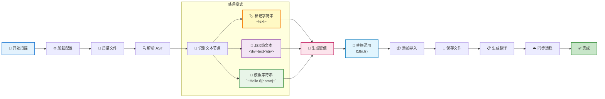

# i18n-google

国际化代码转换工具，自动将代码中的文本转换为国际化函数调用。

## 功能特性

- 🚀 **自动代码转换**：自动将代码中的文本替换为 `I18n.t()` 调用
- 📝 **多种文本支持**：支持字符串字面量、模板字符串和 JSX 文本节点
- 🎯 **智能上下文处理**：智能处理 JSX 和普通 JavaScript 上下文
- 🔧 **灵活标记配置**：支持自定义开始和结尾标记符号
- 📊 **Google Sheets 集成**：与 Google Sheets 双向同步翻译内容
- 🔍 **自动生成唯一键**：基于文件路径和文本内容生成 MD5 哈希键
- 🌐 **多语言支持**：支持多种语言的翻译文件生成
- ⚙️ **TypeScript 支持**：完全使用 TypeScript 编写，提供类型安全
- 🧹 **智能键清理**：自动识别和删除未使用的翻译键 ⭐ **NEW**
- 🔍 **未使用键分析**：深度分析代码以找出废弃的翻译键 ⭐ **NEW**
- 💬 **交互式界面**：友好的命令行交互，支持用户确认和选择 ⭐ **NEW**
- 📊 **操作进度显示**：实时显示清理进度和详细报告 ⭐ **NEW**
- 🛡️ **安全备份机制**：删除前自动备份，支持恢复操作 ⭐ **NEW**

## 配置说明

在项目根目录创建 `i18n.config.js` 配置文件：

```javascript
module.exports = {
  // 指定要扫描的根目录
  rootDir: "./src",

  // 配置支持的语言列表
  languages: ["de", "en", "es", "ko", "tr", "vi", "zh-CN", "zh-TC"],

  // 指定要忽略的目录和文件
  ignore: ["**/test/**", "**/node_modules/**", "test.tsx"],

  // Google Sheets 配置
  spreadsheetId: "your-google-sheet-id",
  sheetName: "translations",
  keyFile: "./serviceAccountKeyFile.json",

  // 标记符号配置
  startMarker: "~", // 开始标记
  endMarker: "~", // 结尾标记

  // 指定要包含的文件类型
  include: ["js", "jsx", "ts", "tsx"],

  // 指定输出目录
  outputDir: "./src/translate",

  // 强制保留的键列表（即使未使用也不会被删除）
  forceKeepKeys: ["important_key", "system_message"],
};
```

### 配置选项说明

| 选项            | 类型     | 说明                        |
| --------------- | -------- | --------------------------- |
| `rootDir`       | string   | 要扫描的根目录              |
| `languages`     | string[] | 支持的语言列表              |
| `ignore`        | string[] | 要忽略的文件/目录匹配模式   |
| `include`       | string[] | 要包含的文件扩展名          |
| `outputDir`     | string   | 翻译文件输出目录            |
| `spreadsheetId` | string   | Google Sheets ID            |
| `sheetName`     | string   | Sheet 名称                  |
| `keyFile`       | string   | Google 服务账号密钥文件路径 |
| `startMarker`   | string   | 开始标记符号                |
| `endMarker`     | string   | 结尾标记符号                |
| `forceKeepKeys` | string[] | 强制保留的键列表 ⭐ **NEW** |

## 处理模式

本工具支持两种文本处理模式：

### 1. 标记符号模式

适用于字符串字面量和模板字符串，需要用标记符号包围文本：

#### 标记符号示例

**使用波浪线标记（默认）**

```javascript
// 配置
startMarker: "~";
endMarker: "~";

// 代码中的用法
const message = "~Hello World~";
const template = `~Hello ${user.name}!~`;
```

**使用自定义标记**

```javascript
// 配置
startMarker: "T_";
endMarker: "_T";

// 代码中的用法
const message = "T_Hello World_T";
const template = `T_Hello ${user.name}!_T`;
```

**使用双括号标记**

```javascript
// 配置
startMarker: "[[";
endMarker: "]]";

// 代码中的用法
const message = "[[Hello World]]";
const template = `[[Hello ${user.name}!]]`;
```

### 2. JSX 纯文本模式

自动处理 JSX 元素中的纯文本节点，无需标记符号：

```jsx
// 自动处理的 JSX 文本
<div>
  Hello World {/* 会被自动转换 */}
  <p>Welcome to our app</p> {/* 会被自动转换 */}
  <span>{"~Marked text~"}</span> {/* 标记模式处理 */}
</div>
```

## 转换示例

### 转换前

```javascript
const message = "~Hello World~";
const template = `~Hello ${user.name}!~`;
const greeting = "Normal text"; // 不会被转换（没有标记符号）

function Component() {
  return (
    <div>
      Pure JSX Text {/* 会被转换（JSX纯文本） */}
      <p title="~Attribute~">Welcome</p> {/* title属性和文本都会被转换 */}
    </div>
  );
}
```

### 转换后

```javascript
import { I18n } from "@utils";

const message = I18n.t("a1b2c3d4");
const template = I18n.t("e5f6g7h8", { var0: user.name });
const greeting = "Normal text";

function Component() {
  return (
    <div>
      {I18n.t("f9g0h1i2")}
      <p title={I18n.t("j3k4l5m6")}>{I18n.t("n7o8p9q0")}</p>
    </div>
  );
}
```

## 核心处理逻辑

1. **字符串检测**：

   - 标记模式：检测以 `startMarker` 开头和 `endMarker` 结尾的字符串
   - JSX 模式：自动检测 JSX 元素中的纯文本节点

2. **格式化处理**：自动去除开始和结尾的标记符号

3. **翻译键生成**：基于文件路径和文本内容生成 MD5 哈希键

4. **智能替换**：
   - 在 JSX 中包装为 `{I18n.t(key)}`
   - 在普通 JS 中直接替换为 `I18n.t(key)`
   - 模板字符串转换为带参数的调用

## 模板字符串处理

对于包含变量的模板字符串：

```javascript
// 原始代码
`~Hello ${name}, you have ${count} items~`;

// 转换为
I18n.t("hash123", { var0: name, var1: count });

// 翻译文本存储为
("Hello %{var0}, you have %{var1} items");
```

## 工作原理

### 处理流程图



### 详细步骤

1. **文件扫描**: 根据配置递归扫描指定目录下的文件
2. **内容识别**: 使用标记符号或 JSX 文本节点检测需要国际化的文案
3. **代码转换**: 使用 jscodeshift 将识别的文案替换为 `I18n.t(key)` 调用
4. **导入注入**: 自动添加 I18n 相关的导入语句
5. **翻译生成**: 为每种语言生成对应的 JSON 翻译文件
6. **远程同步**: 与 Google Sheets 双向同步翻译内容

### Google Sheets 配置

1. 创建 Google Cloud 项目并启用 Google Sheets API
2. 创建服务账号并下载密钥文件
3. 将密钥文件保存为 `serviceAccountKeyFile.json`
4. 与服务账号邮箱共享您的 Google Sheets

## 🧹 智能键清理功能 ⭐ **NEW**

从 v0.1.0 开始，i18n-google 提供了强大的未使用键清理功能，帮助您维护干净的翻译文件。

### 功能特性

- 🔍 **深度代码分析**：扫描所有代码文件，识别真正使用的翻译键
- 🛡️ **安全机制**：删除前自动创建备份，支持一键恢复
- 💬 **交互式界面**：友好的命令行交互，让您完全掌控清理过程
- 📊 **详细报告**：显示清理统计和操作详情
- ⚙️ **灵活配置**：支持强制保留特定键，避免误删

### 使用场景

- 🗑️ **项目重构后**：清理不再使用的旧翻译键
- 📦 **版本发布前**：减少翻译文件大小，提升加载性能
- 🔄 **定期维护**：保持翻译文件的整洁和最新状态
- 👥 **团队协作**：统一清理标准，避免翻译冗余

### 强制保留键配置

对于某些重要的系统键或动态生成的键，您可以配置强制保留：

```javascript
module.exports = {
  // ... 其他配置
  forceKeepKeys: [
    "system.error.network", // 系统错误信息
    "dynamic.key.prefix.*", // 动态生成的键（支持通配符）
    "api.response.success", // API 响应信息
    "email.template.*", // 邮件模板键
  ],
};
```

### 备份和恢复

清理操作会自动创建备份文件：

```
src/translate/
├── backup/
│   ├── 2024-01-15_14-30-25/  # 时间戳备份目录
│   │   ├── zh-CN.json
│   │   ├── en.json
│   │   └── ...
├── zh-CN.json                 # 当前翻译文件
├── en.json
└── ...
```

## 使用方法

### 命令行使用

```bash
# 全局安装后
i18n-google

# 或通过 npx
npx i18n-google

# 项目中使用
npm run scan
```

### 编程使用

```typescript
import { I18nScanner } from "i18n-google";
import config from "./i18n.config.js";

const scanner = new I18nScanner(config);
await scanner.scan();
```

## 生成的翻译文件

`src/translate/zh-CN.json`:

```json
{
  "a1b2c3d4": "Hello World",
  "e5f6g7h8": "Hello %{var0}!",
  "f9g0h1i2": "Pure JSX Text"
}
```

`src/translate/en.json`:

```json
{
  "a1b2c3d4": "Hello World",
  "e5f6g7h8": "Hello %{var0}!",
  "f9g0h1i2": "Pure JSX Text"
}
```

## 安装

### 全局安装

```bash
npm install -g i18n-google
```

### 项目安装

```bash
npm install i18n-google
```

## 开发

### 安装依赖

```bash
npm install
```

### 构建项目

```bash
npm run build
```

### 运行测试

```bash
npm test
```

### 开发模式

```bash
npm run dev
```

## 项目结构

```
i18n-google/
├── core/                       # 核心功能模块
│   ├── I18nScanner.ts         # 主扫描器
│   ├── FileScanner.ts         # 文件扫描器
│   ├── AstTransformer.ts      # AST 转换器
│   ├── TranslationManager.ts  # 翻译管理器
│   ├── GoogleSheetsSync.ts    # Google Sheets 同步
│   ├── KeyDeletionService.ts  # 键删除服务 ⭐ NEW
│   ├── UnusedKeyAnalyzer.ts   # 未使用键分析器 ⭐ NEW
│   ├── RecordManager.ts       # 记录管理器 ⭐ NEW
│   ├── errors/
│   │   └── I18nError.ts       # 自定义错误类 ⭐ NEW
│   ├── ui/
│   │   ├── ProgressIndicator.ts # 进度指示器 ⭐ NEW
│   │   └── UserInteraction.ts   # 用户交互界面 ⭐ NEW
│   └── __tests__/             # 测试文件
├── demo/                      # 示例项目
├── delete/                    # 键删除功能文档 ⭐ NEW
├── scan.ts                    # 入口文件
├── types.ts                   # 类型定义
└── package.json
```

## 优势

- **灵活性**：支持任意自定义标记符号
- **智能化**：自动处理 JSX 纯文本节点
- **向后兼容**：现有项目可以选择适合的标记符号
- **可读性**：标记符号在代码中清晰可见
- **自动化**：一键完成整个国际化流程

## 许可证

ISC License

## 贡献

欢迎提交 Issue 和 Pull Request！

## 支持

如果您在使用过程中遇到问题，请：

1. 查看示例配置
2. 检查 Google Sheets 权限设置
3. 提交 Issue 描述问题
