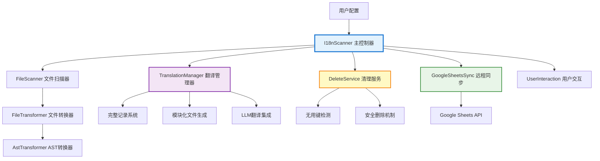
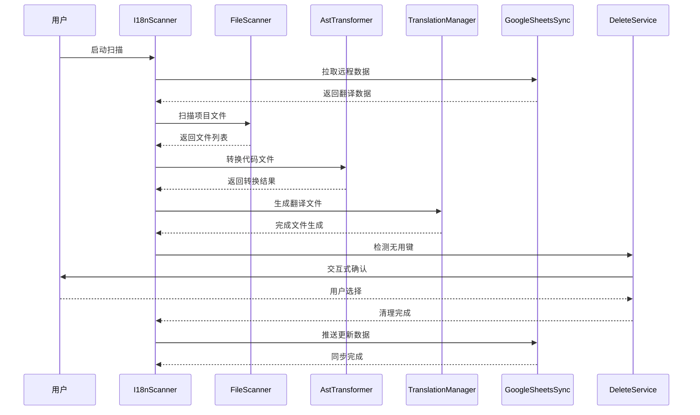

# i18n-google

🚀 **企业级国际化自动化解决方案**

一个功能强大的国际化代码转换工具，提供从代码扫描到翻译管理的完整自动化流程。支持智能代码转换、模块化翻译管理、Google Sheets 同步和智能键清理等企业级功能。

## ✨ 核心特性

### 🔄 智能代码转换

- **自动文本识别**：智能识别字符串字面量、模板字符串和 JSX 文本节点
- **AST 级转换**：基于 jscodeshift 的精确代码转换，保证语法正确性
- **上下文感知**：智能处理 JSX 和普通 JavaScript 不同上下文
- **灵活标记系统**：支持自定义开始和结尾标记符号

### 📦 模块化翻译管理

- **文件路径映射**：基于源文件路径自动生成对应的翻译文件结构
- **完整记录系统**：统一的翻译数据管理格式，支持版本控制
- **增量合并策略**：智能合并本地和远程翻译数据
- **LLM 集成翻译**：自动调用大语言模型进行新键翻译

### 🧠 智能键清理系统

- **深度代码分析**：扫描所有源代码，精确识别真正使用的翻译键
- **安全删除机制**：删除前自动备份，支持一键恢复
- **交互式确认**：友好的命令行界面，完全掌控清理过程
- **强制保留配置**：支持配置重要键，避免误删

### ☁️ Google Sheets 双向同步

- **实时同步**：与 Google Sheets 双向同步翻译内容
- **冲突解决**：智能处理本地和远程数据冲突
- **批量操作**：支持大规模翻译数据的高效同步
- **版本标记**：使用 mark 字段进行版本控制

### 💬 企业级用户体验

- **进度可视化**：实时显示操作进度和详细统计
- **交互式界面**：友好的命令行交互，支持多级确认
- **详细报告**：完整的操作统计和结果摘要
- **错误处理**：分类错误处理和智能恢复机制

### 🔧 技术特性

- **TypeScript 支持**：完全使用 TypeScript 编写，提供完整类型安全
- **模块化架构**：清晰的分层架构，易于扩展和维护
- **性能优化**：并行处理、增量更新、内存优化
- **多语言支持**：支持任意数量的目标语言

## 🚀 快速开始

### 安装

```bash
# 全局安装
npm install -g i18n-google

# 项目安装
npm install i18n-google
```

### 基础配置

在项目根目录创建 `i18n.config.js` 配置文件：

```javascript
module.exports = {
  // 基础配置
  rootDir: "./src", // 扫描根目录
  outputDir: "./src/translate", // 翻译文件输出目录
  languages: ["en", "zh-CN", "es"], // 支持的语言列表
  include: ["js", "jsx", "ts", "tsx"], // 包含的文件类型

  // 标记符号配置
  startMarker: "~", // 开始标记
  endMarker: "~", // 结尾标记

  // 文件过滤
  ignore: ["**/test/**", "**/node_modules/**", "**/*.test.*"],

  // Google Sheets 同步（可选）
  spreadsheetId: "your-google-sheet-id",
  sheetName: "translations",
  keyFile: "./serviceAccountKeyFile.json",
  sheetsReadRange: "A1:Z10000", // Google Sheets 读取范围
  sheetsMaxRows: 10000, // Sheets 最大行数

  // 智能清理配置
  forceKeepKeys: {
    "components/Header.ts": ["brand_name", "navigation_menu"],
    "pages/auth.ts": ["login_title", "session_expired"],
  },

  // LLM 翻译配置
  apiKey: "your-openai-api-key", // 用于自动翻译新键

  // 高级配置
  logLevel: "normal", // silent | normal | verbose
};
```

### 立即使用

```bash
# 运行扫描
i18n-google

# 或通过 npx
npx i18n-google

# 项目中使用
npm run scan
```

## ⚙️ 详细配置

### 基础配置选项

| 选项          | 类型     | 默认值                    | 说明                      |
| ------------- | -------- | ------------------------- | ------------------------- |
| `rootDir`     | string   | `"./src"`                 | 要扫描的根目录            |
| `outputDir`   | string   | `"./src/translate"`       | 翻译文件输出目录          |
| `languages`   | string[] | `["en"]`                  | 支持的语言列表            |
| `include`     | string[] | `["js","jsx","ts","tsx"]` | 要包含的文件扩展名        |
| `ignore`      | string[] | `[]`                      | 要忽略的文件/目录匹配模式 |
| `startMarker` | string   | `"~"`                     | 开始标记符号              |
| `endMarker`   | string   | `"~"`                     | 结尾标记符号              |

### Google Sheets 配置

| 选项              | 类型   | 说明                        |
| ----------------- | ------ | --------------------------- |
| `spreadsheetId`   | string | Google Sheets 文档 ID       |
| `sheetName`       | string | 工作表名称                  |
| `keyFile`         | string | Google 服务账号密钥文件路径 |
| `sheetsReadRange` | string | Google Sheets 读取范围      |
| `sheetsMaxRows`   | number | Sheets 最大行数限制         |

### 智能清理配置

| 选项            | 类型   | 说明             |
| --------------- | ------ | ---------------- |
| `forceKeepKeys` | object | 强制保留的键配置 |

**forceKeepKeys 配置示例：**

```javascript
// 按模块配置强制保留的键（精确匹配）
forceKeepKeys: {
  "components/Header.ts": ["brand_name", "navigation_menu"],
  "pages/auth.ts": ["login_title", "session_expired"],
  "utils/constants.ts": ["API_BASE_URL", "CONFIG_VERSION"]
}
```

### LLM 翻译配置

| 选项     | 类型   | 说明                              |
| -------- | ------ | --------------------------------- |
| `apiKey` | string | OpenAI API 密钥，用于自动翻译新键 |

### 高级配置

| 选项          | 类型   | 默认值     | 说明                                    |
| ------------- | ------ | ---------- | --------------------------------------- |
| `logLevel`    | string | `"normal"` | 日志级别：`silent`\|`normal`\|`verbose` |
| `concurrency` | number | `5`        | 并发处理数量                            |
| `maxFileSize` | number | `1MB`      | 单文件最大处理大小                      |
| `encoding`    | string | `"utf8"`   | 文件编码格式                            |

### 日志级别说明

- **`silent`**：静默模式，不输出任何日志信息，适用于 CI/CD 环境
- **`normal`**（推荐）：标准模式，输出关键操作信息和用户友好提示
- **`verbose`**：详细模式，输出完整的调试信息，适用于开发和问题排查

## 🏗️ 技术架构

### 系统架构图



### 核心模块说明

#### 🎯 I18nScanner - 主控制器

- **职责**：协调整个扫描和转换流程
- **功能**：配置验证、流程编排、错误处理
- **位置**：[`src/core/I18nScanner.ts`](src/core/I18nScanner.ts)

#### 📁 FileScanner - 文件扫描器

- **职责**：文件系统扫描和过滤
- **功能**：递归目录扫描、文件类型过滤、忽略规则处理
- **位置**：[`src/core/FileScanner.ts`](src/core/FileScanner.ts)

#### 🔄 AstTransformer - AST 转换器

- **职责**：基于 jscodeshift 的代码转换
- **功能**：AST 解析、节点识别、代码替换、导入注入
- **位置**：[`src/core/AstTransformer.ts`](src/core/AstTransformer.ts)

#### 📦 TranslationManager - 翻译管理器

- **职责**：翻译数据的统一管理
- **功能**：完整记录维护、模块化文件生成、增量合并
- **位置**：[`src/core/TranslationManager.ts`](src/core/TranslationManager.ts)

#### 🧹 DeleteService - 智能清理服务

- **职责**：无用翻译键的检测和清理
- **功能**：深度代码分析、安全删除、备份恢复
- **位置**：[`src/core/DeleteService.ts`](src/core/DeleteService.ts)

#### ☁️ GoogleSheetsSync - 远程同步

- **职责**：与 Google Sheets 的双向数据同步
- **功能**：API 集成、数据格式转换、冲突解决
- **位置**：[`src/core/GoogleSheetsSync.ts`](src/core/GoogleSheetsSync.ts)

### 数据流程



## 📝 处理模式

本工具支持两种文本处理模式：

### 1. 标记符号模式

适用于字符串字面量和模板字符串，需要用标记符号包围文本：

#### 标记符号示例

**使用波浪线标记（默认）**

```javascript
// 配置
startMarker: "~";
endMarker: "~";

// 代码中的用法
const message = "~Hello World~";
const template = `~Hello ${user.name}!~`;
```

**使用自定义标记**

```javascript
// 配置
startMarker: "T_";
endMarker: "_T";

// 代码中的用法
const message = "T_Hello World_T";
const template = `T_Hello ${user.name}!_T`;
```

**使用双括号标记**

```javascript
// 配置
startMarker: "[[";
endMarker: "]]";

// 代码中的用法
const message = "[[Hello World]]";
const template = `[[Hello ${user.name}!]]`;
```

### 2. JSX 纯文本模式

自动处理 JSX 元素中的纯文本节点，无需标记符号：

```jsx
// 自动处理的 JSX 文本
<div>
  Hello World {/* 会被自动转换 */}
  <p>Welcome to our app</p> {/* 会被自动转换 */}
  <span>{"~Marked text~"}</span> {/* 标记模式处理 */}
</div>
```

## 🔄 转换示例

### 转换前

```javascript
const message = "~Hello World~";
const template = `~Hello ${user.name}!~`;
const greeting = "Normal text"; // 不会被转换（没有标记符号）

function Component() {
  return (
    <div>
      Pure JSX Text {/* 会被转换（JSX纯文本） */}
      <p title="~Attribute~">Welcome</p> {/* title属性和文本都会被转换 */}
    </div>
  );
}
```

### 转换后

```javascript
import { I18n } from "@utils";

const message = I18n.t("a1b2c3d4");
const template = I18n.t("e5f6g7h8", { var0: user.name });
const greeting = "Normal text";

function Component() {
  return (
    <div>
      {I18n.t("f9g0h1i2")}
      <p title={I18n.t("j3k4l5m6")}>{I18n.t("n7o8p9q0")}</p>
    </div>
  );
}
```

## 🔧 核心处理逻辑

1. **字符串检测**：

   - 标记模式：检测以 `startMarker` 开头和 `endMarker` 结尾的字符串
   - JSX 模式：自动检测 JSX 元素中的纯文本节点

2. **格式化处理**：自动去除开始和结尾的标记符号

3. **翻译键生成**：基于文件路径和文本内容生成 MD5 哈希键

4. **智能替换**：
   - 在 JSX 中包装为 `{I18n.t(key)}`
   - 在普通 JS 中直接替换为 `I18n.t(key)`
   - 模板字符串转换为带参数的调用

## 📋 模板字符串处理

对于包含变量的模板字符串：

```javascript
// 原始代码
`~Hello ${name}, you have ${count} items~`;

// 转换为
I18n.t("hash123", { var0: name, var1: count });

// 翻译文本存储为
("Hello %{var0}, you have %{var1} items");
```

## ⚙️ 工作原理

### 处理流程图


### 详细步骤

1. **文件扫描**: 根据配置递归扫描指定目录下的文件
2. **内容识别**: 使用标记符号或 JSX 文本节点检测需要国际化的文案
3. **代码转换**: 使用 jscodeshift 将识别的文案替换为 `I18n.t(key)` 调用
4. **导入注入**: 自动添加 I18n 相关的导入语句
5. **翻译生成**: 为每种语言生成对应的 JSON 翻译文件
6. **远程同步**: 与 Google Sheets 双向同步翻译内容

## ☁️ Google Sheets 配置

### 设置步骤

1. 创建 Google Cloud 项目并启用 Google Sheets API
2. 创建服务账号并下载密钥文件
3. 将密钥文件保存为 `serviceAccountKeyFile.json`
4. 与服务账号邮箱共享您的 Google Sheets

### 数据格式

Google Sheets 中的数据格式：

```
| key | en | zh-CN | es | fr | mark |
|-----|----|----|----|----|------|
| [components/Header.ts][Welcome] | Welcome | 欢迎 | Bienvenido | Bienvenue | 0 |
| [pages/home.ts][Get Started] | Get Started | 开始使用 | Comenzar | Commencer | 1 |
```

## 🧹 智能键清理功能

### 功能特性

- 🔍 **深度代码分析**：扫描所有代码文件，识别真正使用的翻译键
- 🛡️ **安全机制**：删除前自动创建备份，支持一键恢复
- 💬 **交互式界面**：友好的命令行交互，让您完全掌控清理过程
- 📊 **详细报告**：显示清理统计和操作详情
- ⚙️ **灵活配置**：支持强制保留特定键，避免误删

### 使用场景

- 🗑️ **项目重构后**：清理不再使用的旧翻译键
- 📦 **版本发布前**：减少翻译文件大小，提升加载性能
- 🔄 **定期维护**：保持翻译文件的整洁和最新状态
- 👥 **团队协作**：统一清理标准，避免翻译冗余

### 交互式清理界面

```bash
🔍 发现 15 个可删除的无用翻译Key

? 请选择删除方式:
❯ 🗑️ 全部删除 (15 个Key)
  🎯 手动选择要删除的Key
  ❌ 跳过删除

# 手动选择界面
? 请选择要删除的Key (共15个) - 使用空格选择，回车确认
❯ ◯   1. [components/OldComponent.ts][deprecated_message]
  ◯   2. [pages/removed.ts][old_title]
  ◯   3. [utils/helper.ts][unused_text]
```

### 删除预览

清理操作会生成预览文件供用户确认：

```
src/translate/
├── delete-preview-2024-01-15T14-30-25-123Z.json  # 删除预览文件
├── components/
│   ├── Header.ts
│   └── Button.ts
└── i18n-complete-record.json                      # 完整翻译记录
```

## 📦 模块化翻译管理

### 完整记录系统

```typescript
// 数据结构
interface CompleteTranslationRecord {
  [translationPath: string]: {
    [translationKey: string]: {
      [languageKey: string]: string;
    } & {
      mark?: number; // 标记字段，用于版本控制
    };
  };
}

// 实际数据示例
{
  "components/Header.ts": {
    "Welcome": {
      "en": "Welcome",
      "zh-CN": "欢迎",
      "es": "Bienvenido",
      "mark": 0
    },
    "Hello %{var0}": {
      "en": "Hello %{var0}",
      "zh-CN": "你好 %{var0}",
      "es": "Hola %{var0}",
      "mark": 0
    }
  }
}
```

### 模块化文件生成

```typescript
// 自动生成的翻译文件结构
src/
├── components/
│   ├── Header.tsx          // 源文件
│   └── Button.tsx
└── translate/              // 翻译文件目录
    └── components/
        ├── Header.ts       // 对应的翻译文件
        └── Button.ts
```

### 生成的翻译文件格式

```typescript
// src/translate/components/Header.ts
const translations = {
  en: {
    Welcome: "Welcome",
    "Hello %{var0}": "Hello %{var0}",
    "Click to continue": "Click to continue",
  },
  "zh-CN": {
    Welcome: "欢迎",
    "Hello %{var0}": "你好 %{var0}",
    "Click to continue": "点击继续",
  },
  es: {
    Welcome: "Bienvenido",
    "Hello %{var0}": "Hola %{var0}",
    "Click to continue": "Haz clic para continuar",
  },
};

export default translations;
```

## 💻 使用方法

### 命令行使用

```bash
# 全局安装后
i18n-google

# 或通过 npx
npx i18n-google

# 项目中使用
npm run scan
```

### 编程使用

```typescript
import { I18nScanner } from "i18n-google";
import config from "./i18n.config.js";

const scanner = new I18nScanner(config);
await scanner.scan();
```

### 运行时输出示例

```bash
🚀 开始国际化扫描...
☁️ 从远端拉取翻译数据... ✅
🔧 初始化翻译管理器... ✅
📁 扫描项目文件... ✅ (找到 45 个文件)
🔍 分析文件引用... ✅ (发现 128 个引用)
🗑️ 检测无用Key... ✅ (发现 12 个无用Key)

📊 扫描结果摘要
==================================================
📁 处理文件数: 45
🔑 总翻译Key数: 128
✨ 新增Key数: 8
🗑️ 无用Key数: 12
⏱️ 执行时间: 2.3s
==================================================
```

## 📄 生成的翻译文件

### 模块化格式

`src/translate/components/Header.ts`:

```typescript
export default {
  en: {
    Welcome: "Welcome",
    Navigation: "Navigation",
  },
  "zh-CN": {
    Welcome: "欢迎",
    Navigation: "导航",
  },
};
```

## 📚 最佳实践

### 🎯 项目集成建议

**1. 渐进式集成**

```bash
# 第一步：小范围测试
rootDir: "./src/components/common"  # 先测试公共组件

# 第二步：扩大范围
rootDir: "./src/components"         # 扩展到所有组件

# 第三步：全项目覆盖
rootDir: "./src"                    # 覆盖整个项目
```

**2. 标记符号选择**

```javascript
// 推荐：使用简洁明了的标记
startMarker: "~";
endMarker: "~";

// 避免：与现有代码冲突的标记
startMarker: "{{"; // 可能与模板语法冲突
endMarker: "}}";
```

**3. 强制保留键配置**

```javascript
forceKeepKeys: {
  "components/Modal.ts": [
    "confirm_dialog",    // 确认对话框
    "cancel_button"      // 取消按钮
  ],
  "utils/errors.ts": [
    "network_error",     // 网络错误
    "validation_failed"  // 验证失败
  ]
}
```

### 🔧 性能优化建议

**1. 优化忽略规则**

```javascript
ignore: [
  "**/node_modules/**", // 必须忽略
  "**/dist/**", // 构建输出
  "**/coverage/**", // 测试覆盖率
  "**/*.test.*", // 测试文件
  "**/*.spec.*", // 规范文件
  "**/storybook-static/**", // Storybook 输出
];
```

### 🚀 CI/CD 集成

**GitHub Actions 示例**

```yaml
name: i18n Check
on: [push, pull_request]

jobs:
  i18n-check:
    runs-on: ubuntu-latest
    steps:
      - uses: actions/checkout@v3
      - uses: actions/setup-node@v3
        with:
          node-version: "18"

      - name: Install dependencies
        run: npm ci

      - name: Run i18n scan
        run: npx i18n-google
        env:
          GOOGLE_SHEETS_API_KEY: ${{ secrets.GOOGLE_SHEETS_API_KEY }}
```

## 🔍 故障排除

### 常见问题解决

**1. Google Sheets 连接失败**

```bash
# 错误信息
Error: Unable to connect to Google Sheets API

# 解决方案
✅ 检查服务账号密钥文件路径
✅ 确认 Google Sheets API 已启用
✅ 验证工作表共享权限
✅ 检查网络连接
```

**2. 文件转换失败**

```bash
# 错误信息
Error: Failed to transform file: syntax error

# 解决方案
✅ 检查文件语法是否正确
✅ 确认文件编码为 UTF-8
✅ 验证 jscodeshift 兼容性
✅ 查看详细错误日志 (logLevel: "verbose")
```

**3. 翻译键冲突**

```bash
# 错误信息
Warning: Duplicate translation key detected

# 解决方案
✅ 检查是否有重复的翻译文本
✅ 确认文件路径映射正确
✅ 使用强制保留键避免误删
✅ 手动解决冲突后重新运行
```

**4. 内存不足**

```bash
# 错误信息
Error: JavaScript heap out of memory

# 解决方案
✅ 减少并发数量 (concurrency: 3)
✅ 增加 Node.js 内存限制
✅ 分批处理大型项目
✅ 优化忽略规则减少文件数量
```

### 调试技巧

**1. 启用详细日志**

```javascript
// 配置文件
logLevel: "verbose"

// 或环境变量
DEBUG=i18n-google:* npx i18n-google
```

**2. 分步骤测试**

```bash
# 只测试文件扫描
i18n-google --dry-run

# 只测试特定目录
rootDir: "./src/components/Button"

# 跳过远程同步
spreadsheetId: ""  # 留空跳过同步
```

**3. 备份验证**

```bash
# 检查备份文件
ls -la src/translate/backup/

# 恢复备份（如需要）
cp -r src/translate/backup/latest/* src/translate/
```

## 🌟 企业级特性

### 大规模项目支持

- **批量处理**：支持处理数千个文件的大型项目
- **增量更新**：只处理变更的文件，提升效率
- **内存优化**：智能内存管理，避免内存溢出
- **并发控制**：可配置的并发数量，平衡速度和资源使用

### 团队协作功能

- **统一配置**：团队共享配置文件，保证一致性
- **版本控制**：翻译数据版本标记，支持回滚
- **冲突解决**：智能处理多人协作时的数据冲突
- **权限管理**：基于 Google Sheets 的细粒度权限控制

### 质量保证

- **类型安全**：完整的 TypeScript 支持
- **错误处理**：分类错误处理和智能恢复
- **数据验证**：翻译数据完整性验证
- **自动备份**：操作前自动备份，支持一键恢复

## 📈 性能指标

### 处理能力

- **文件处理速度**：平均 50-100 文件/秒
- **翻译键生成**：平均 1000+ 键/秒
- **Google Sheets 同步**：支持 10,000+ 行数据
- **内存使用**：典型项目 < 500MB

### 扩展性

- **项目规模**：支持 10,000+ 文件的大型项目
- **翻译键数量**：支持 100,000+ 翻译键
- **语言数量**：支持 50+ 目标语言
- **并发处理**：最高支持 10 个并发任务

## 🎯 优势总结

- **🚀 高效自动化**：一键完成从代码扫描到翻译文件生成的全流程
- **🧠 智能处理**：基于 AST 的精确代码转换和智能键清理
- **📦 模块化管理**：文件路径映射的模块化翻译文件组织
- **☁️ 云端同步**：与 Google Sheets 的实时双向同步
- **🛡️ 企业级可靠性**：完整的错误处理、备份恢复和类型安全
- **👥 团队协作友好**：统一配置、版本控制和权限管理
- **🔧 高度可配置**：灵活的配置选项适应各种项目需求
- **📊 可视化体验**：友好的命令行界面和详细的操作报告

## 🛠️ 开发

### 安装依赖

```bash
npm install
```

### 构建项目

```bash
npm run build
```

### 运行测试

```bash
npm test
```

### 开发模式

```bash
npm run dev
```

## 📄 许可证

ISC License

## 🤝 贡献

欢迎提交 Issue 和 Pull Request！

### 贡献指南

1. Fork 本仓库
2. 创建特性分支 (`git checkout -b feature/AmazingFeature`)
3. 提交更改 (`git commit -m 'Add some AmazingFeature'`)
4. 推送到分支 (`git push origin feature/AmazingFeature`)
5. 开启 Pull Request

## 💬 支持

如果您在使用过程中遇到问题，请：

1. **查看文档**：仔细阅读配置说明和最佳实践
2. **检查配置**：验证 `i18n.config.js` 配置是否正确
3. **启用调试**：使用 `logLevel: "verbose"` 获取详细信息
4. **查看示例**：参考项目中的示例配置
5. **提交 Issue**：详细描述问题和环境信息

### 获取帮助

- 📖 [文档](README.md)
- 🐛 [问题反馈](https://github.com/your-repo/issues)
- 💡 [功能建议](https://github.com/your-repo/issues/new?template=feature_request.md)
- 📧 [邮件支持](mailto:support@example.com)

---

## 国际化方案对比分析：i18n-google vs. 主流库

本文档是对 `i18n-google`、现代的 `next-intl` 以及经典的 `next-i18next` 进行的最终、全面的对比总结，涵盖了设计哲学、核心功能、开发体验及潜在缺陷。

---

### 一、核心设计哲学

> #### 🪄 i18n-google (本项目): “自动化魔法” + 工作流编排器
>
> 一个功能全面、高度集成的解决方案，旨在通过一个 `scan` 命令完成“同步-扫描-转换-清理-生成-同步”的完整闭环。其核心是**自动化**和对源代码的**直接转换 (codemod)**。

> #### 🤝 `next-intl`: “交互式引导” + 现代开发者工具集
>
> 一套轻量、正交的工具（库、API、IDE 插件），让开发者在编码过程中，通过**实时反馈**和**主动标记**的方式完成 i18n 工作。其核心是**开发者体验**和与 **Next.js App Router** 的无缝集成。

> #### 🌱 `next-i18next`: “成熟生态” + 经典配置驱动
>
> 依托于久经考验的 `i18next` 生态，提供了一套功能丰富、高度可配置的解决方案。在 **Pages Router** 中表现极其稳定，但在 App Router 中的集成不如 `next-intl` 原生。

---

### 二、功能特性横向对比

| 特性               | i18n-google (本项目)                   | `next-intl`                        | `next-i18next`                           |
| :----------------- | :------------------------------------- | :--------------------------------- | :--------------------------------------- |
| **提取 ✍️**        | **自动代码重写** (`scan` 脚本)         | **手动标记** + **IDE 实时创建**    | **手动标记** + **命令行提取** / IDE 创建 |
| **体验 😊**        | **批处理模式** (开发时无感)            | **实时交互模式** (IDE 引导)        | **混合模式** (IDE 或命令行)              |
| **密钥 🔑**        | **基于内容** (e.g., `t('你好')`)       | **基于 ID** (e.g., `t('welcome')`) | **基于 ID** (e.g., `t('welcome')`)       |
| **模块化 📦**      | **基于文件路径** (自动镜像 `src` 目录) | **基于命名空间** (开发者手动指定)  | **基于命名空间** (开发者手动指定)        |
| **性能 ⚡️**       | **仅按模块加载** (存在性能缺陷)        | **按模块 + 按语言加载** (性能最优) | **按模块 + 按语言加载** (性能优秀)       |
| **清理 🧹**        | **内置核心功能** (带预览)              | 依赖社区工具                       | 依赖社区工具                             |
| **协作 🤝**        | **内置 Google Sheets 同步**            | 灵活集成各种 TMS (需配置)          | 灵活集成各种 TMS (生态成熟)              |
| **App Router 🧭**  | 自定义实现 (兼容性待定)                | **最佳** (专为 App Router 设计)    | **一般** (集成相对繁琐)                  |
| **侵入性 🔬**      | **高** (脚本作为 codemod 重写源码)     | **低** (生态工具只读源码，不修改)  | **低** (生态工具只读源码，不修改)        |
| **老项目迁移成本** | **极低** (脚本自动化改造)              | **极高** (需要大量手动重构)        | **极高** (需要大量手动重构)              |

---

### 三、总结与展望

#### i18n-google (本项目)

- **✅ 优点**:
  - **极低的成熟项目迁移成本**: `scan` 脚本的核心优势在于能**自动化**地为已存的大量硬编码文本进行国际化改造，这是主流库手动重构方式无法比拟的。
  - **自动化程度极高**: 一键完成从代码转换到云同步的全流程。
  - **强大的维护功能**: 内置的无用 Key 清理是巨大优势。
  - **对开发者透明**: 在编码阶段，心智负担几乎为零。
- **❌ 当前缺点**:
  - **性能瓶颈**: 模块化文件未按语言分割，导致客户端加载了不必要的翻译数据。
  - **工作流割裂**: 批处理模式缺乏实时反馈。
  - **密钥脆弱**: 基于内容的密钥在文案变更时会导致所有翻译失效。
- **🚀 改进建议**:
  1.  **重构生成逻辑**，实现按语言生成独立的翻译文件，并改造 `I18nUtil` 以支持动态加载，解决性能瓶颈。
  2.  **配置 i18n Ally**，引入 IDE 实时反馈，弥补工作流割裂问题。
  3.  **升级密钥策略**，改为脚本自动生成稳定的 ID，增强系统健壮性。

#### next-intl

- **✅ 优点**:
  - **性能最佳**: 真正的按需加载。
  - **开发体验流畅**: 与 IDE 和 App Router 的结合天衣无缝。
  - **类型安全**: 提供了优秀的 TypeScript 支持。
- **❌ 缺点**:
  - **生态相对年轻**: 相比 `i18next`，工具链和插件选择较少。
  - **功能相对精简**: 像无用 Key 清理这样的高级功能需要自己动手或寻找社区方案。

#### next-i18next

- **✅ 优点**:
  - **生态极其成熟**: 拥有庞大的插件、工具和社区支持。
  - **高度可配置**: 提供了丰富的选项来满足各种复杂场景。
  - **稳定可靠**: 在 Pages Router 时代是绝对的王者。
- **❌ 缺点**:
  - **与 App Router 的适配不佳**: 其设计哲学与 App Router 的服务器组件模式不完全匹配，集成成本高。
  - **API 相对繁琐**: 配置和使用上比 `next-intl` 更复杂。

综上所述，`i18n-google` 是一个功能强大的企业级工具，尤其在自动化和维护性上表现出色。其主要的改进方向是**提升性能**和**优化开发体验**。通过借鉴 `next-intl` 的“按需加载”和“IDE 实时交互”理念，您的方案有潜力成为一个集两家之长、既自动化又高效的顶级国际化解决方案。

---

#### 附注：关于“侵入性”的精确定义

“侵入性”在此处特指国际化工具是否会**修改开发者编写的源代码**。

- **高侵入性 (High Intrusiveness)**：指工具（如本项目的 `scan` 脚本）会作为代码转换器 (codemod) 运行，自动将代码中的裸露字符串（`'你好'`）重写为函数调用（`t('你好')`）。开发者编写的并非最终代码。
- **低侵入性 (Low Intrusiveness)**：指工具（如 `i18n-ally` 或 `i18next-parser`）只会**读取**源代码来识别 `t()` 函数调用，以提供辅助功能（如创建缺失的 key），但**绝不会修改**开发者已经写好的代码。开发者编写的代码即是最终代码。

`next-intl` 和 `next-i18next` 库本身不提供提取功能，其生态工具遵循的是低侵入性原则。
