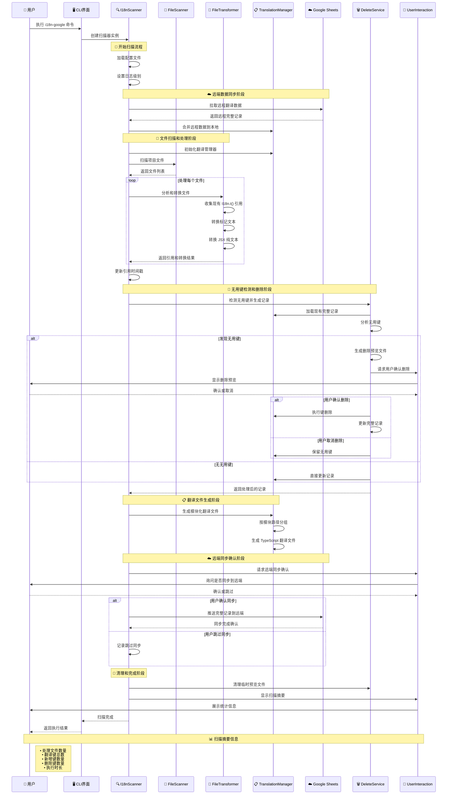
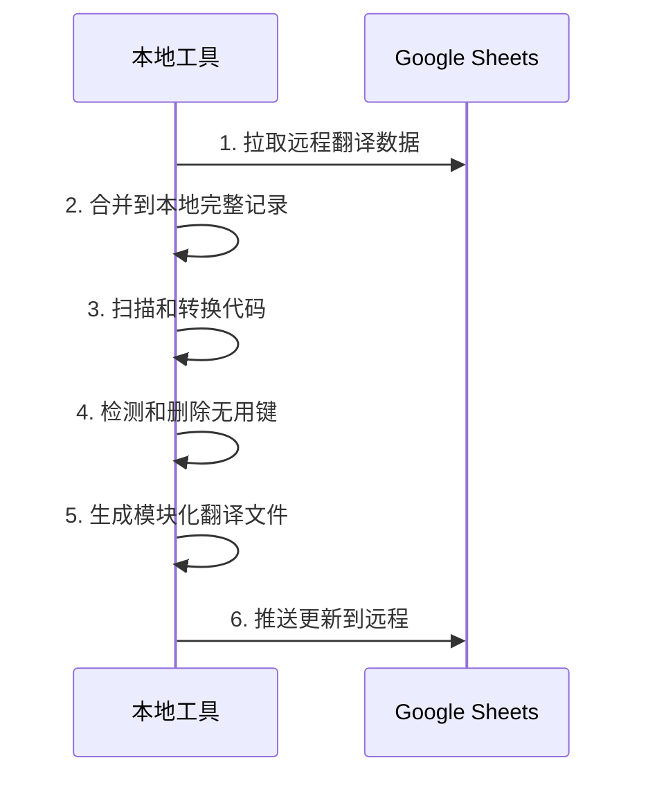

# i18n-google

一个智能的国际化自动化工具，支持代码转换、Google Sheets 集成和模块化翻译管理。

## 🚀 核心特性

### 自动化代码转换

- 🔄 **智能文本识别**：自动识别需要国际化的文本内容
- 🎯 **多种处理模式**：支持标记符号模式和 JSX 纯文本模式
- 🔧 **AST 级别转换**：使用 jscodeshift 进行精确的代码转换
- 📦 **自动导入管理**：智能添加和管理 I18n 相关导入

### 模块化翻译系统

- 📁 **模块化文件结构**：按组件/页面组织翻译文件
- 🔑 **原文案作为 Key**：提高可读性和维护性
- 🌐 **多语言支持**：支持任意数量的目标语言
- 📊 **完整记录管理**：维护翻译的完整生命周期记录

### 智能键管理

- 🧹 **智能清理**：自动检测和清理未使用的翻译键
- ⏰ **时间基础检测**：支持基于时间的过期键检测
- 🛡️ **安全保护**：强制保留关键系统键，防止误删
- 💾 **备份恢复**：删除前自动备份，支持一键恢复

### Google Sheets 集成

- ☁️ **双向同步**：与 Google Sheets 进行双向翻译同步
- 🔄 **增量更新**：智能合并远程和本地翻译数据
- 📈 **实时协作**：支持团队协作翻译管理

### 用户体验

- 💬 **交互式界面**：友好的命令行交互体验
- 📊 **进度显示**：实时显示操作进度和详细报告
- 🎛️ **灵活配置**：丰富的配置选项满足不同需求
- 📝 **详细日志**：支持多级别日志输出

## 📋 系统架构

### 核心组件

```
src/
├── core/                    # 核心服务层
│   ├── I18nScanner.ts      # 主扫描器 - 协调整个流程
│   ├── FileScanner.ts      # 文件扫描器 - 递归扫描项目文件
│   ├── FileTransformer.ts  # 文件转换器 - 代码转换和引用收集
│   ├── AstTransformer.ts   # AST 转换器 - 底层 AST 操作
│   ├── TranslationManager.ts # 翻译管理器 - 翻译文件和记录管理
│   ├── GoogleSheetsSync.ts # Google Sheets 同步器
│   ├── UnusedKeyAnalyzer.ts # 无用键分析器 - 检测过期和未使用的键
│   ├── DeleteService.ts    # 删除服务 - 处理键删除逻辑
│   └── PreviewFileService.ts # 预览文件服务 - 生成删除预览
├── ui/                     # 用户界面层
│   ├── ProgressIndicator.ts # 进度指示器
│   └── UserInteraction.ts  # 用户交互处理
├── utils/                  # 工具层
│   ├── StringUtils.ts      # 字符串处理和日志工具
│   ├── AstUtils.ts         # AST 工具函数
│   └── PathUtils.ts        # 路径处理工具
├── errors/                 # 错误处理
│   └── I18nError.ts        # 自定义错误类型
└── types.ts                # TypeScript 类型定义
```

### 核心流程图

```mermaid
flowchart TD
    A[🚀 开始扫描] --> B[⚙️ 加载配置文件]
    B --> C[📊 设置日志级别]
    C --> D[🔄 从远端拉取翻译数据]
    D --> E[📋 合并到本地完整记录]
    E --> F[🔧 初始化翻译管理器]
    F --> G[📁 扫描项目文件]
    G --> H[🔍 并行处理文件]

    subgraph "文件处理阶段"
        H --> I[📖 收集现有 I18n.t() 引用]
        H --> J[🔄 转换标记文本为 I18n.t()]
        H --> K[📝 转换 JSX 纯文本]
        I --> L[🔗 合并所有引用数据]
        J --> L
        K --> L
    end

    L --> M[🕒 更新引用时间戳]
    M --> N[🔍 检测无用键]
    N --> O{发现无用键?}

    O -->|是| P[📄 生成删除预览文件]
    P --> Q[💬 用户确认删除]
    Q --> R{用户确认?}
    R -->|是| S[🗑️ 执行键删除]
    R -->|否| T[📝 保留无用键]

    O -->|否| U[📋 生成模块化翻译文件]
    S --> V[🔄 更新完整记录]
    T --> V
    V --> U

    U --> W[💬 用户确认远端同步]
    W --> X{同步到远端?}
    X -->|是| Y[☁️ 推送到 Google Sheets]
    X -->|否| Z[⏭️ 跳过远端同步]

    Y --> AA[🧹 清理临时文件]
    Z --> AA
    AA --> BB[📊 显示扫描摘要]
    BB --> CC[✅ 扫描完成]

    style A fill:#e3f2fd,stroke:#1976d2,stroke-width:3px
    style CC fill:#c8e6c9,stroke:#388e3c,stroke-width:3px
    style P fill:#fff3e0,stroke:#f57c00,stroke-width:2px
    style S fill:#ffebee,stroke:#d32f2f,stroke-width:2px
    style Y fill:#e8f5e8,stroke:#388e3c,stroke-width:2px
```

### 完整时序图



## ⚙️ 配置说明

在项目根目录创建 `i18n.config.js` 配置文件：

```javascript
module.exports = {
  // 基础配置
  rootDir: "./src", // 扫描根目录
  outputDir: "./src/translate", // 翻译文件输出目录
  languages: ["en", "zh-CN", "zh-TC", "ko", "es", "tr", "de", "vi"],

  // 文件处理配置
  include: ["js", "jsx", "ts", "tsx"], // 包含的文件类型
  ignore: [
    // 忽略的文件/目录
    "**/test/**",
    "**/node_modules/**",
    "**/*.test.*",
  ],

  // 标记符号配置
  startMarker: "~", // 开始标记符号
  endMarker: "~", // 结束标记符号

  // Google Sheets 配置
  spreadsheetId: "your-google-sheet-id",
  sheetName: "translations",
  keyFile: "./serviceAccountKeyFile.json",
  apiKey: "your-google-api-key",
  sheetsReadRange: "A1:Z10000", // 读取范围

  // 键管理配置
  forceKeepKeys: {
    // 强制保留的键（按模块）
    "src/components/Header": ["system.title"],
    "src/pages/error": ["error.network", "error.timeout"],
  },
  keyExpirationDays: 30, // 键过期天数（可选）

  // 系统配置
  logLevel: "normal", // 日志级别: silent, normal, verbose
};
```

### 配置选项详解

| 配置项              | 类型         | 说明                        | 默认值      |
| ------------------- | ------------ | --------------------------- | ----------- |
| `rootDir`           | string       | 扫描的根目录路径            | -           |
| `outputDir`         | string       | 翻译文件输出目录            | -           |
| `languages`         | string[]     | 支持的语言代码列表          | -           |
| `include`           | string[]     | 包含的文件扩展名            | -           |
| `ignore`            | string[]     | 忽略的文件/目录模式         | -           |
| `startMarker`       | string       | 文本开始标记符号            | -           |
| `endMarker`         | string       | 文本结束标记符号            | -           |
| `spreadsheetId`     | string       | Google Sheets 文档 ID       | -           |
| `sheetName`         | string       | 工作表名称                  | -           |
| `keyFile`           | string       | Google 服务账号密钥文件路径 | -           |
| `apiKey`            | string       | Google API 密钥             | -           |
| `sheetsReadRange`   | string       | Google Sheets 读取范围      | "A1:Z10000" |
| `forceKeepKeys`     | object/array | 强制保留的键配置            | -           |
| `keyExpirationDays` | number       | 键过期天数（启用时间检测）  | undefined   |
| `logLevel`          | string       | 日志级别                    | "normal"    |

## 🔧 处理模式

### 1. 标记符号模式

适用于字符串字面量和模板字符串：

```javascript
// 配置
startMarker: "~";
endMarker: "~";

// 使用示例
const message = "~Hello World~";
const template = `~Welcome ${user.name}!~`;
const attr = <div title="~Click me~">Content</div>;

// 转换后
const message = I18n.t("Hello World");
const template = I18n.t("Welcome %{var0}!", { var0: user.name });
const attr = <div title={I18n.t("Click me")}>Content</div>;
```

### 2. JSX 纯文本模式

自动处理 JSX 元素中的纯文本：

```jsx
// 原始代码
function Component() {
  return (
    <div>
      Welcome to our app {/* 自动转换 */}
      <p>Get started now</p> {/* 自动转换 */}
      <span>{"~Marked text~"}</span> {/* 标记模式 */}
    </div>
  );
}

// 转换后
function Component() {
  return (
    <div>
      {I18n.t("Welcome to our app")}
      <p>{I18n.t("Get started now")}</p>
      <span>{I18n.t("Marked text")}</span>
    </div>
  );
}
```

## 📁 模块化翻译系统

### 文件结构

```
src/translate/
├── i18n-complete-record.json          # 完整翻译记录
├── src/
│   ├── components/
│   │   ├── Header/
│   │   │   └── index.ts               # Header 组件翻译
│   │   └── Button/
│   │       └── index.ts               # Button 组件翻译
│   └── pages/
│       ├── home/
│       │   └── index.ts               # 首页翻译
│       └── about/
│           └── index.ts               # 关于页翻译
└── const/
    └── const.ts                       # 常量翻译
```

### 翻译文件格式

```typescript
// src/translate/src/components/Header/index.ts
const translations = {
  en: {
    "Welcome to our website": "Welcome to our website",
    "User Profile": "User Profile",
    "Sign Out": "Sign Out",
  },
  "zh-CN": {
    "Welcome to our website": "欢迎来到我们的网站",
    "User Profile": "用户资料",
    "Sign Out": "退出登录",
  },
  "zh-TC": {
    "Welcome to our website": "歡迎來到我們的網站",
    "User Profile": "用戶資料",
    "Sign Out": "退出登錄",
  },
};

export default translations;
```

### 完整记录格式

```json
{
  "src/components/Header": {
    "Welcome to our website": {
      "en": "Welcome to our website",
      "zh-CN": "欢迎来到我们的网站",
      "zh-TC": "歡迎來到我們的網站",
      "_lastUsed": 1704067200000
    },
    "User Profile": {
      "en": "User Profile",
      "zh-CN": "用户资料",
      "zh-TC": "用戶資料",
      "_lastUsed": 1704067200000
    }
  }
}
```

## 🧹 智能键管理

### 无用键检测

工具提供两种检测模式：

#### 1. 引用检测模式（默认）

```javascript
// 配置
module.exports = {
  // 不设置 keyExpirationDays 或设置为 undefined
  keyExpirationDays: undefined,
};
```

#### 2. 时间检测模式

```javascript
// 配置
module.exports = {
  keyExpirationDays: 30, // 30天未使用的键视为过期
};
```

### 强制保留配置

```javascript
// 数组格式（全局保留）
forceKeepKeys: ["system.error", "api.timeout"]

// 对象格式（按模块保留）
forceKeepKeys: {
  "src/components/ErrorBoundary": ["error.network", "error.unknown"],
  "src/utils/api": ["api.timeout", "api.retry"],
  "src/pages/admin": ["admin.*"]  // 支持通配符
}
```

### 删除预览

删除前会生成详细的预览文件：

```json
{
  "timestamp": "2024-01-15T10:30:00.000Z",
  "totalKeysToDelete": 5,
  "keysToDelete": [
    {
      "key": "Old unused message",
      "translations": {
        "en": "Old unused message",
        "zh-CN": "旧的未使用消息"
      },
      "reason": "未在代码中找到引用"
    }
  ],
  "affectedLanguages": ["en", "zh-CN"]
}
```

## 📊 Google Sheets 集成

### 设置步骤

1. **创建 Google Cloud 项目**

   - 访问 [Google Cloud Console](https://console.cloud.google.com/)
   - 创建新项目或选择现有项目

2. **启用 Google Sheets API**

   - 在 API 库中搜索并启用 "Google Sheets API"

3. **创建服务账号**

   - 创建服务账号并下载 JSON 密钥文件
   - 将文件保存为 `serviceAccountKeyFile.json`

4. **共享 Google Sheets**
   - 将服务账号邮箱添加到 Google Sheets 的编辑者列表

### 同步机制



## 🚀 使用方法

### 安装

```bash
# 全局安装
npm install -g i18n-google

# 项目安装
npm install i18n-google --save-dev
```

### 命令行使用

```bash
# 直接运行（全局安装后）
i18n-google

# 通过 npx 运行
npx i18n-google

# 项目脚本
npm run scan
```

### 编程使用

```typescript
import { I18nScanner } from "i18n-google";
import config from "./i18n.config.js";

const scanner = new I18nScanner(config);

async function runScan() {
  try {
    await scanner.scan();
    console.log("扫描完成！");
  } catch (error) {
    console.error("扫描失败:", error);
  }
}

runScan();
```

## 🎯 前端集成

### I18n 工具类

```typescript
// src/utils/i18n.ts
interface ModuleTranslations {
  [locale: string]: { [key: string]: string };
}

class I18nUtil {
  static getCurrentLocale(): string {
    if (typeof window === "undefined") return "en";
    const params = new URLSearchParams(window.location.search);
    return localStorage.getItem("locale") || params.get("lang") || "en";
  }

  static createScoped(translations: ModuleTranslations) {
    const locale = this.getCurrentLocale();
    return {
      t: (key: string, params?: Record<string, any>) => {
        let text = translations[locale]?.[key] || key;

        // 处理参数插值
        if (params) {
          Object.entries(params).forEach(([key, value]) => {
            text = text.replace(new RegExp(`%{${key}}`, "g"), String(value));
          });
        }

        return text;
      },
    };
  }

  static switchLocale(newLocale: string): void {
    localStorage.setItem("locale", newLocale);
    const url = new URL(window.location.href);
    url.searchParams.set("lang", newLocale);
    window.location.href = url.toString();
  }
}

export { I18nUtil };
```

### 组件使用示例

```typescript
// src/components/Header.tsx
import React from "react";
import { I18nUtil } from "@/utils/i18n";
import translations from "@/translate/src/components/Header";

function Header() {
  const I18n = I18nUtil.createScoped(translations);

  return (
    <header>
      <h1>{I18n.t("Welcome to our website")}</h1>
      <nav>
        <a href="/profile">{I18n.t("User Profile")}</a>
        <button onClick={() => signOut()}>{I18n.t("Sign Out")}</button>
      </nav>
    </header>
  );
}

export default Header;
```

### 语言切换组件

```typescript
// src/components/LanguageSwitcher.tsx
import React from "react";
import { I18nUtil } from "@/utils/i18n";

const languages = [
  { code: "en", name: "English" },
  { code: "zh-CN", name: "中文（简体）" },
  { code: "zh-TC", name: "中文（繁體）" },
  { code: "ko", name: "한국어" },
];

function LanguageSwitcher() {
  const currentLocale = I18nUtil.getCurrentLocale();

  return (
    <select
      value={currentLocale}
      onChange={(e) => I18nUtil.switchLocale(e.target.value)}
    >
      {languages.map((lang) => (
        <option key={lang.code} value={lang.code}>
          {lang.name}
        </option>
      ))}
    </select>
  );
}

export default LanguageSwitcher;
```

## 🧪 测试和开发

### 运行测试

```bash
npm test
```

### 开发模式

```bash
npm run dev
```

### 构建项目

```bash
npm run build
```

### 示例项目

项目包含两个完整的示例：

- `demo/nextjs/` - Next.js 集成示例
- `demo/vite/` - Vite + React 集成示例

## 📈 最佳实践

### 1. 翻译键命名

```javascript
// ✅ 推荐：使用清晰的英文描述
"Welcome to our platform";
"User profile updated successfully";
"Please enter a valid email address";

// ❌ 避免：使用缩写或不清晰的描述
"WelcomeMsg";
"UpSuccess";
"EmailErr";
```

### 2. 模块化组织

```
// ✅ 推荐：按功能模块组织
src/translate/
├── src/components/auth/     # 认证相关组件
├── src/components/profile/  # 用户资料相关
├── src/pages/dashboard/     # 仪表板页面
└── src/utils/validation/    # 验证工具

// ❌ 避免：所有翻译放在一个文件
src/translate/all-translations.ts
```

### 3. 强制保留配置

```javascript
// ✅ 推荐：按模块精确配置
forceKeepKeys: {
  "src/components/ErrorBoundary": ["error.*"],
  "src/utils/api": ["api.timeout", "api.retry"],
  "src/config/constants": ["app.name", "app.version"]
}

// ❌ 避免：全局保留过多键
forceKeepKeys: ["error.*", "api.*", "system.*", "app.*"]
```

### 4. 日志级别选择

```javascript
// 开发环境：详细日志
logLevel: "verbose";

// 生产环境：标准日志
logLevel: "normal";

// CI/CD：静默模式
logLevel: "silent";
```

## 🔧 故障排除

### 常见问题

1. **Google Sheets 同步失败**

   - 检查服务账号权限
   - 确认 API 密钥有效性
   - 验证 spreadsheetId 正确性

2. **翻译文件未生成**

   - 检查 outputDir 权限
   - 确认配置文件格式正确
   - 查看详细日志输出

3. **代码转换异常**
   - 检查文件编码格式
   - 确认语法没有错误
   - 查看 AST 解析日志

### 调试技巧

```bash
# 启用详细日志
echo 'module.exports = { ...config, logLevel: "verbose" }' > i18n.config.js

# 查看扫描过程
npx i18n-google 2>&1 | tee scan.log

# 检查生成的文件
find ./src/translate -name "*.ts" -exec echo "=== {} ===" \; -exec cat {} \;
```

## 📄 许可证

MIT License

## 🤝 贡献

欢迎提交 Issue 和 Pull Request！

### 开发指南

1. Fork 项目
2. 创建功能分支
3. 提交更改
4. 推送到分支
5. 创建 Pull Request

## 📞 支持

如果您在使用过程中遇到问题，请：

1. 查看[示例项目](./demo/)
2. 检查[配置文档](#-配置说明)
3. 提交 [Issue](https://github.com/947776795/i18n-google/issues)

---


