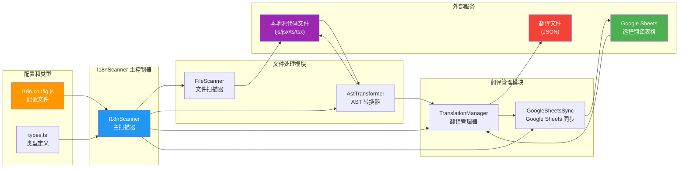

# I18n Google

一个自动化的国际化(i18n)扫描系统，集成 Google Sheets 翻译管理功能。

## 功能特性

- 🔍 **自动扫描**: 递归扫描项目文件，自动识别需要国际化的文案
- 🔄 **代码转换**: 使用 jscodeshift 自动替换文案为 i18n 调用
- 📊 **Google Sheets 集成**: 与 Google Sheets 双向同步翻译内容
- 🌐 **多语言支持**: 支持多种语言的翻译文件生成
- ⚙️ **灵活配置**: 可自定义扫描规则、文件类型和输出目录
- 🚀 **TypeScript 支持**: 完全使用 TypeScript 编写，提供类型安全

## 工作原理

1. **文件扫描**: 根据配置递归扫描指定目录下的文件
2. **内容识别**: 使用自定义规则识别需要国际化的文案（如 `%文案内容%`）
3. **代码转换**: 使用 jscodeshift 将识别的文案替换为 `I18n.t(key)` 调用
4. **导入注入**: 自动添加 I18n 相关的导入语句
5. **翻译生成**: 为每种语言生成对应的 JSON 翻译文件
6. **远程同步**: 与 Google Sheets 双向同步翻译内容

### 执行流程图

```mermaid
flowchart TD
    A["开始执行 i18n-google"] --> B["加载 i18n.config.js 配置文件"]
    B --> C["创建 I18nScanner 实例"]
    C --> D["初始化各个组件模块"]

    D --> E["1. 初始化翻译管理器<br/>(TranslationManager)"]
    E --> F["创建输出目录<br/>检查语言配置"]

    F --> G["2. 扫描文件<br/>(FileScanner)"]
    G --> H["递归扫描 rootDir 目录"]
    H --> I["应用 ignore 规则过滤"]
    I --> J["按 include 文件类型筛选"]
    J --> K["返回待处理文件列表"]

    K --> L["3. 处理每个文件<br/>(AstTransformer)"]
    L --> M["解析文件为 AST"]
    M --> N["查找匹配 check.test 的文案"]
    N --> O{"发现需要翻译的文案?"}

    O -->|是| P["使用 format 函数处理文案"]
    P --> Q["生成唯一的翻译 key"]
    Q --> R["替换文案为 I18n.t(key)"]
    R --> S["检查并添加 I18n 导入"]
    S --> T["保存修改后的文件"]
    T --> U["收集翻译项到内存"]

    O -->|否| V["跳过当前文件"]
    V --> W["处理下一个文件"]
    U --> W

    W --> X{"所有文件处理完成?"}
    X -->|否| L
    X -->|是| Y["4. 从 Google Sheets 同步翻译<br/>(GoogleSheetsSync)"]

    Y --> Z["使用服务账号认证"]
    Z --> AA["连接到指定的 spreadsheetId"]
    AA --> BB["读取 sheetName 中的翻译数据"]
    BB --> CC["解析远程翻译内容"]
    CC --> DD["更新本地翻译数据"]

    DD --> EE["5. 保存翻译文件<br/>(TranslationManager)"]
    EE --> FF["为每种语言创建 JSON 文件"]
    FF --> GG["写入到 outputDir 目录"]

    GG --> HH["6. 同步到 Google Sheets<br/>(GoogleSheetsSync)"]
    HH --> II["准备本地翻译数据"]
    II --> JJ["批量更新 Google Sheets"]
    JJ --> KK["处理新增和修改的翻译"]

    KK --> LL["扫描流程完成"]

    style A fill:#e1f5fe
    style LL fill:#c8e6c9
    style O fill:#fff3e0
    style X fill:#fff3e0
```



### 模块架构图



### 代码转换详细流程

```mermaid
flowchart TD
    subgraph "AstTransformer 代码转换详细流程"
        A["读取源代码文件"] --> B["使用 jscodeshift 解析为 AST"]
        B --> C["遍历 AST 节点"]
        C --> D{"是否为字符串字面量?"}

        D -->|是| E["应用 check.test 检查"]
        E --> F{"匹配翻译规则?"}

        F -->|是| G["使用 format 函数清理文案"]
        G --> H["生成翻译 key<br/>(MD5 或其他算法)"]
        H --> I["替换为 I18n.t(key) 调用"]
        I --> J["检查文件顶部导入"]
        J --> K{"已存在 I18n 导入?"}

        K -->|否| L["添加 import { I18n } from '@utils'"]
        K -->|是| M["跳过导入添加"]
        L --> M

        M --> N["继续遍历下一个节点"]

        F -->|否| O["保持原样，继续下一个节点"]
        D -->|否| O
        O --> N

        N --> P{"所有节点遍历完成?"}
        P -->|否| C
        P -->|是| Q["生成修改后的代码"]
        Q --> R["写回文件"]
        R --> S["返回收集的翻译项"]
    end

    subgraph "示例转换"
        T["原始代码:<br/>'%欢迎使用%'"] --> U["生成 key:<br/>'welcome_message'"]
        U --> V["转换后:<br/>I18n.t('welcome_message')"]
        V --> W["翻译项:<br/>{key: 'welcome_message',<br/>value: '欢迎使用'}"]
    end

    style A fill:#e3f2fd
    style S fill:#c8e6c9
    style F fill:#fff3e0
    style K fill:#fff3e0
    style P fill:#fff3e0
```



## 安装

### 全局安装

```bash
npm install -g i18n-google
```

### 项目安装

```bash
npm install i18n-google
```

## 配置

在项目根目录创建 `i18n.config.js` 配置文件：

```javascript
module.exports = {
  // 指定要扫描的根目录
  rootDir: "./src",

  // 配置支持的语言列表
  languages: ["de", "en", "es", "ko", "tr", "vi", "zh-CN", "zh-TC"],

  // 指定要忽略的目录和文件
  ignore: ["**/test/**", "**/node_modules/**", "test.tsx"],

  // Google Sheets 配置
  spreadsheetId: "your-google-sheet-id",
  sheetName: "translations",
  keyFile: "./serviceAccountKeyFile.json",

  // 检查是否是未翻译的文案
  check: {
    test: (value) => value.startsWith("%") && value.endsWith("%"),
  },

  // 格式化文案内容
  format(value) {
    return value.replace(/^%+|%+$/g, "");
  },

  // 指定要包含的文件类型
  include: ["js", "jsx", "ts", "tsx"],

  // 指定输出目录
  outputDir: "./src/translate",
};
```

### Google Sheets 配置

1. 创建 Google Cloud 项目并启用 Google Sheets API
2. 创建服务账号并下载密钥文件
3. 将密钥文件保存为 `serviceAccountKeyFile.json`
4. 与服务账号邮箱共享您的 Google Sheets

## 使用方法

### 命令行使用

```bash
# 全局安装后
i18n-google

# 或通过 npx
npx i18n-google

# 项目中使用
npm run scan
```

### 编程使用

```typescript
import { I18nScanner } from "i18n-google";
import config from "./i18n.config.js";

const scanner = new I18nScanner(config);
await scanner.scan();
```

## 示例

### 转换前的代码

```tsx
function Welcome() {
  return <div>{"%欢迎使用我们的产品%"}</div>;
}
```

### 转换后的代码

```tsx
import { I18n } from "@utils";

function Welcome() {
  return <div>{I18n.t("welcome_message")}</div>;
}
```

### 生成的翻译文件

`src/translate/zh-CN.json`:

```json
{
  "welcome_message": "欢迎使用我们的产品"
}
```

`src/translate/en.json`:

```json
{
  "welcome_message": "Welcome to our product"
}
```

## 配置选项说明

| 选项            | 类型     | 说明                        |
| --------------- | -------- | --------------------------- |
| `rootDir`       | string   | 要扫描的根目录              |
| `languages`     | string[] | 支持的语言列表              |
| `ignore`        | string[] | 要忽略的文件/目录匹配模式   |
| `include`       | string[] | 要包含的文件扩展名          |
| `outputDir`     | string   | 翻译文件输出目录            |
| `spreadsheetId` | string   | Google Sheets ID            |
| `sheetName`     | string   | Sheet 名称                  |
| `keyFile`       | string   | Google 服务账号密钥文件路径 |
| `check.test`    | function | 检测文案的函数              |
| `format`        | function | 格式化文案的函数            |

## 开发

### 安装依赖

```bash
npm install
```

### 构建项目

```bash
npm run build
```

### 运行测试

```bash
npm test
```

### 开发模式

```bash
npm run dev
```

## 项目结构

```
i18n-google/
├── core/                    # 核心功能模块
│   ├── I18nScanner.ts      # 主扫描器
│   ├── FileScanner.ts      # 文件扫描器
│   ├── AstTransformer.ts   # AST 转换器
│   ├── TranslationManager.ts # 翻译管理器
│   ├── GoogleSheetsSync.ts # Google Sheets 同步
│   └── __tests__/          # 测试文件
├── demo/                   # 示例项目
├── scan.ts                 # 入口文件
├── types.ts               # 类型定义
└── package.json
```

## 许可证

ISC License

## 贡献

欢迎提交 Issue 和 Pull Request！

## 支持

如果您在使用过程中遇到问题，请：

1. 查看示例配置
2. 检查 Google Sheets 权限设置
3. 提交 Issue 描述问题
