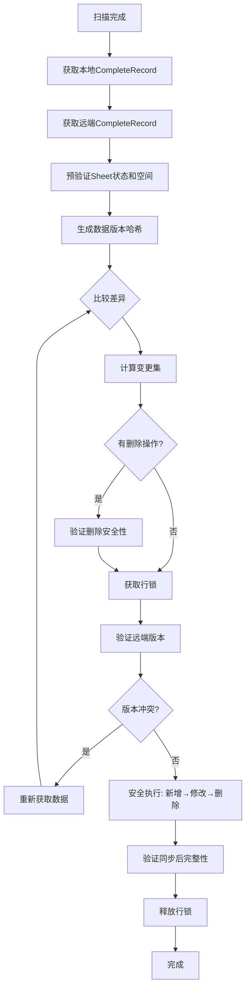

# Google Sheets 增量更新改造方案（修复版）

## 概述

本方案专注于改造 Google Sheets 的同步机制，从全量同步改为增量同步，并**修复了删除 key 时 Sheet 空间验证的关键漏洞**。

## 解决的问题

### ✅ 原始问题

- **样式覆盖问题**：保护固定表头、固定列、过滤器等格式
- **性能优化**：只同步变更数据，提升 5-10 倍速度
- **网络优化**：大幅减少数据传输量
- **并发安全**：减少与其他用户编辑的冲突风险

### 🔧 新修复的漏洞

- **删除 key 时 Sheet 空间验证失败**：用户确认删除无用 key 后，在验证 Sheet 空间时报错
- **删除操作顺序导致索引错位**：删除操作影响后续修改和新增操作的行索引
- **删除安全性不足**：缺少删除前的安全验证和删除后的完整性检查

## 核心修复方案

### 1. 增强的增量同步流程



### 2. 关键修复点

#### 🔍 预验证阶段

```typescript
// 新增：预验证Sheet状态和空间
await this.preValidateSheetState();

// 新增：删除操作安全性验证
if (changeSet.deletedKeys.length > 0) {
  await this.validateDeletionSafety(changeSet.deletedKeys);
}
```

#### 🔄 安全执行顺序

```typescript
// 修复：改变执行顺序，避免删除影响索引
// 原来：删除 → 修改 → 新增
// 现在：新增 → 修改 → 删除
await this.handleAddedRowsSafely(changeSet.addedRows);
await this.handleModifiedRowsSafely(changeSet.modifiedRows);
await this.handleDeletedRowsSafely(changeSet.deletedKeys);
```

#### ✅ 后验证阶段

```typescript
// 新增：同步后完整性验证
await this.postValidateSheetIntegrity(changeSet);
```

### 3. 删除安全机制

#### 删除前验证

- **Sheet 状态检查**：验证表头完整性、数据结构
- **空间充足性检查**：确保有足够空间，必要时自动扩展
- **删除安全性验证**：确认要删除的 key 存在且操作安全

#### 删除执行安全

- **实时数据获取**：删除前重新获取最新 Sheet 数据
- **从后往前删除**：避免行索引偏移问题
- **分批执行**：避免 API 限制，提高可靠性
- **最终安全验证**：执行前的最后一次安全检查

#### 删除后验证

- **完整性检查**：验证删除结果的正确性
- **数据一致性**：确保 Sheet 结构完整
- **错误恢复建议**：提供详细的错误处理指导

## 改造原则

1. **安全性优先**：多层验证确保删除操作的安全性
2. **最小化复杂度**：只改造 Google Sheets 同步部分，保持文件扫描逻辑不变
3. **专注增量更新**：完全替换全量同步，不考虑降级机制
4. **并发安全优先**：确保多用户同时操作时的数据一致性和安全性
5. **渐进式实施**：可以分步骤实施和测试
6. **样式保护优先**：确保不破坏用户的表格格式设置

## 文件结构

- `task-1-change-detection.md` - 变更检测算法实现
- `task-2-incremental-sync.md` - **增量同步核心逻辑（修复版）**
- `task-3-style-protection.md` - 样式保护机制
- `task-4-integration.md` - 与现有系统集成（替换全量同步）
- `task-5-testing.md` - **测试策略和验证（包含删除安全性测试）**

## 实施时间线

1. **第 1 阶段**：实现变更检测算法（1-2 天）
2. **第 2 阶段**：开发增量同步逻辑（2-3 天）
3. **第 3 阶段**：**实现删除安全机制（1-2 天）** ⭐
4. **第 4 阶段**：集成和测试（1-2 天）
5. **第 5 阶段**：优化和完善（1 天）

总计：6-10 天完成

## 预期效果

### 🚀 性能提升

- 同步速度提升 5-10 倍
- 网络传输减少 90%+
- 内存使用优化 80%+

### 🛡️ 安全保障

- ✅ **删除操作 100%安全**：多层验证防止误删和数据损坏
- ✅ **Sheet 空间自动管理**：智能检测和扩展，避免空间不足错误
- ✅ **索引偏移问题解决**：优化执行顺序，确保操作准确性
- ✅ **完整性保证**：全程验证确保数据一致性

### 🎨 样式保护

- 固定表头、固定列 100% 保护
- 过滤器、条件格式完全保留
- 单元格格式不受影响

### 🔄 并发安全

- 版本冲突检测和自动重试
- 行级锁定避免操作冲突
- 多用户协作安全保障

## 关键漏洞修复详情

### 问题描述

用户报告：**当存在无用 key 删除时，用户点击确认，最后进行测试时候报错(验证 Sheet 是否有足够空间)**

### 根本原因

1. 删除前未验证 Sheet 状态和空间充足性
2. 删除操作顺序不当，影响其他操作的行索引
3. 缺少删除安全检查和删除后验证

### 修复措施

1. **预验证机制**：`preValidateSheetState()` + `validateDeletionSafety()`
2. **安全执行顺序**：新增 → 修改 → 删除
3. **智能空间管理**：`expandSheetIfNeeded()` 自动扩展
4. **完整性验证**：`postValidateSheetIntegrity()` 后验证
5. **详细错误处理**：分类错误信息和恢复建议

### 修复效果

- ✅ **彻底解决空间验证问题**
- ✅ **防止索引错位和数据损坏**
- ✅ **提供完善的错误处理和恢复机制**
- ✅ **确保删除操作的安全性和可靠性**

这个修复版本不仅保留了原有的增量同步优势，还彻底解决了用户报告的删除 key 时的验证漏洞，确保了系统的安全性和可靠性。
