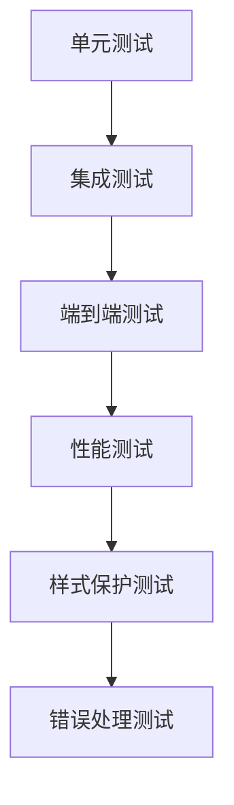

# Task 5: 测试策略和验证

## 目标

建立全面的测试体系，确保增量更新功能的正确性、性能和可靠性。

## 测试策略概览

### 1. 测试层次结构



### 2. 测试覆盖范围

- ✅ **功能正确性**：确保增量同步逻辑正确
- ✅ **样式保护**：验证 Google Sheets 格式不被破坏
- ✅ **性能表现**：确保速度提升达到预期
- ✅ **错误处理**：验证各种异常情况的处理
- ✅ **稳定性**：确保增量同步的稳定性和可靠性
- ✅ **并发安全**：测试多用户同时操作的场景

## 单元测试

### 1. 变更检测算法测试

```typescript
describe("变更检测算法", () => {
  let googleSheetsSync: GoogleSheetsSync;

  beforeEach(() => {
    googleSheetsSync = new GoogleSheetsSync(testConfig);
  });

  describe("calculateChangeSet", () => {
    test("检测新增 key", () => {
      const remote = {};
      const local = {
        "TestModule.ts": {
          new_key: { en: "New Text", "zh-Hans": "新文本", mark: 0 },
        },
      };

      const changeSet = googleSheetsSync.calculateChangeSet(remote, local);

      expect(changeSet.addedRows).toHaveLength(1);
      expect(changeSet.addedRows[0].key).toBe("[TestModule.ts][New Text]");
      expect(changeSet.modifiedRows).toHaveLength(0);
      expect(changeSet.deletedKeys).toHaveLength(0);
    });

    test("检测修改 key", () => {
      const remote = {
        "TestModule.ts": {
          existing_key: { en: "Old Text", "zh-Hans": "旧文本", mark: 0 },
        },
      };
      const local = {
        "TestModule.ts": {
          existing_key: { en: "Old Text", "zh-Hans": "新文本", mark: 0 },
        },
      };

      const changeSet = googleSheetsSync.calculateChangeSet(remote, local);

      expect(changeSet.addedRows).toHaveLength(0);
      expect(changeSet.modifiedRows).toHaveLength(1);
      expect(changeSet.modifiedRows[0].key).toBe("[TestModule.ts][Old Text]");
      expect(changeSet.deletedKeys).toHaveLength(0);
    });

    test("检测删除 key", () => {
      const remote = {
        "TestModule.ts": {
          old_key: { en: "Old Text", "zh-Hans": "旧文本", mark: 0 },
        },
      };
      const local = {};

      const changeSet = googleSheetsSync.calculateChangeSet(remote, local);

      expect(changeSet.addedRows).toHaveLength(0);
      expect(changeSet.modifiedRows).toHaveLength(0);
      expect(changeSet.deletedKeys).toHaveLength(1);
      expect(changeSet.deletedKeys[0]).toBe("[TestModule.ts][Old Text]");
    });

    test("检测 mark 字段变更", () => {
      const remote = {
        "TestModule.ts": {
          test_key: { en: "Test", "zh-Hans": "测试", mark: 0 },
        },
      };
      const local = {
        "TestModule.ts": {
          test_key: { en: "Test", "zh-Hans": "测试", mark: 1 },
        },
      };

      const changeSet = googleSheetsSync.calculateChangeSet(remote, local);

      expect(changeSet.modifiedRows).toHaveLength(1);
    });

    test("处理复杂变更场景", () => {
      const remote = {
        "ModuleA.ts": {
          key1: { en: "Text1", "zh-Hans": "文本1", mark: 0 },
          key2: { en: "Text2", "zh-Hans": "文本2", mark: 0 },
        },
        "ModuleB.ts": {
          key3: { en: "Text3", "zh-Hans": "文本3", mark: 0 },
        },
      };

      const local = {
        "ModuleA.ts": {
          key1: { en: "Text1", "zh-Hans": "新文本1", mark: 0 }, // 修改
          key4: { en: "Text4", "zh-Hans": "文本4", mark: 0 }, // 新增
        },
        "ModuleC.ts": {
          key5: { en: "Text5", "zh-Hans": "文本5", mark: 0 }, // 新增模块
        },
        // ModuleB.ts 整个删除
      };

      const changeSet = googleSheetsSync.calculateChangeSet(remote, local);

      expect(changeSet.addedRows).toHaveLength(2); // key4, key5
      expect(changeSet.modifiedRows).toHaveLength(1); // key1
      expect(changeSet.deletedKeys).toHaveLength(2); // key2, key3
    });
  });

  describe("辅助方法测试", () => {
    test("buildCombinedKey", () => {
      const key = googleSheetsSync.buildCombinedKey(
        "TestModule.ts",
        "test_key",
        { en: "Test Text", "zh-Hans": "测试文本" }
      );

      expect(key).toBe("[TestModule.ts][Test Text]");
    });

    test("hasTranslationChanged", () => {
      const local = { en: "Text", "zh-Hans": "文本", mark: 0 };
      const remote1 = { en: "Text", "zh-Hans": "文本", mark: 0 };
      const remote2 = { en: "Text", "zh-Hans": "新文本", mark: 0 };
      const remote3 = { en: "Text", "zh-Hans": "文本", mark: 1 };

      expect(googleSheetsSync.hasTranslationChanged(local, remote1)).toBe(
        false
      );
      expect(googleSheetsSync.hasTranslationChanged(local, remote2)).toBe(true);
      expect(googleSheetsSync.hasTranslationChanged(local, remote3)).toBe(true);
    });

    test("isChangeSetEmpty", () => {
      const emptyChangeSet = {
        addedRows: [],
        modifiedRows: [],
        deletedKeys: [],
      };

      const nonEmptyChangeSet = {
        addedRows: [{ key: "test", values: ["test"] }],
        modifiedRows: [],
        deletedKeys: [],
      };

      expect(googleSheetsSync.isChangeSetEmpty(emptyChangeSet)).toBe(true);
      expect(googleSheetsSync.isChangeSetEmpty(nonEmptyChangeSet)).toBe(false);
    });
  });
});
```

### 2. 样式保护机制测试

```typescript
describe("样式保护机制", () => {
  let styleValidator: StyleValidator;

  beforeEach(() => {
    styleValidator = new StyleValidator(testConfig);
  });

  test("captureStyleSnapshot", async () => {
    // Mock Google Sheets API 响应
    const mockSheetData = {
      gridProperties: {
        frozenRowCount: 1,
        frozenColumnCount: 0,
      },
      basicFilter: { range: { startRowIndex: 0, endRowIndex: 100 } },
      filterViews: [],
      conditionalFormats: [{ ranges: [{ startRowIndex: 1, endRowIndex: 10 }] }],
    };

    jest
      .spyOn(styleValidator, "getSheetMetadata")
      .mockResolvedValue(mockSheetData);

    const snapshot = await styleValidator.captureStyleSnapshot();

    expect(snapshot).toEqual({
      frozenRowCount: 1,
      frozenColumnCount: 0,
      hasAutoFilter: true,
      filterViewCount: 0,
      conditionalFormatRuleCount: 1,
    });
  });

  test("validateStyleIntegrity", async () => {
    const beforeSnapshot = {
      frozenRowCount: 1,
      frozenColumnCount: 0,
      hasAutoFilter: true,
      filterViewCount: 0,
      conditionalFormatRuleCount: 1,
    };

    const afterSnapshot = {
      frozenRowCount: 1,
      frozenColumnCount: 0,
      hasAutoFilter: true,
      filterViewCount: 0,
      conditionalFormatRuleCount: 1,
    };

    jest
      .spyOn(styleValidator, "captureStyleSnapshot")
      .mockResolvedValue(afterSnapshot);

    const result = await styleValidator.validateStyleIntegrity(beforeSnapshot);

    expect(result.isValid).toBe(true);
    expect(result.issues).toHaveLength(0);
  });

  test("检测样式变更", async () => {
    const beforeSnapshot = {
      frozenRowCount: 1,
      frozenColumnCount: 0,
      hasAutoFilter: true,
      filterViewCount: 0,
      conditionalFormatRuleCount: 1,
    };

    const afterSnapshot = {
      frozenRowCount: 0, // 固定行被清除
      frozenColumnCount: 0,
      hasAutoFilter: false, // 过滤器被清除
      filterViewCount: 0,
      conditionalFormatRuleCount: 0, // 条件格式被清除
    };

    jest
      .spyOn(styleValidator, "captureStyleSnapshot")
      .mockResolvedValue(afterSnapshot);

    const result = await styleValidator.validateStyleIntegrity(beforeSnapshot);

    expect(result.isValid).toBe(false);
    expect(result.issues).toContain("固定行数变化: 1 -> 0");
    expect(result.issues).toContain("自动筛选器状态变化");
  });
});
```

### 3. 错误处理测试

```typescript
describe("错误处理机制", () => {
  let errorHandler: SyncErrorHandler;

  beforeEach(() => {
    errorHandler = new SyncErrorHandler();
  });

  test("analyzeError - 网络错误", () => {
    const networkError = new Error("ENOTFOUND googleapis.com");
    const errorType = errorHandler.analyzeError(networkError);
    expect(errorType).toBe("NETWORK_ERROR");
  });

  test("analyzeError - API 限制错误", () => {
    const rateLimitError = new Error("Rate limit exceeded");
    const errorType = errorHandler.analyzeError(rateLimitError);
    expect(errorType).toBe("API_RATE_LIMIT");
  });

  test("analyzeError - 认证错误", () => {
    const authError = new Error("Authentication failed");
    const errorType = errorHandler.analyzeError(authError);
    expect(errorType).toBe("AUTHENTICATION_ERROR");
  });

  test("handleIncrementalSyncError - 网络错误重试", async () => {
    const networkError = new Error("ENOTFOUND");
    const config = {
      ...testConfig,
      incrementalSync: { fallbackToFullSync: true },
    };
    const completeRecord = {};

    const fallbackSpy = jest
      .spyOn(errorHandler, "fallbackToFullSync")
      .mockResolvedValue();

    await errorHandler.handleIncrementalSyncError(
      networkError,
      config,
      completeRecord
    );

    expect(fallbackSpy).toHaveBeenCalledWith(completeRecord, config);
  });

  test("handleIncrementalSyncError - 认证错误直接抛出", async () => {
    const authError = new Error("Authentication failed");
    const config = testConfig;
    const completeRecord = {};

    await expect(
      errorHandler.handleIncrementalSyncError(authError, config, completeRecord)
    ).rejects.toThrow("Authentication failed");
  });
});
```

## 集成测试

### 1. 端到端增量同步测试

```typescript
describe("端到端增量同步", () => {
  let googleSheetsSync: GoogleSheetsSync;
  let mockGoogleSheets: any;

  beforeEach(() => {
    // 创建 Google Sheets API 的 mock
    mockGoogleSheets = createMockGoogleSheetsAPI();
    googleSheetsSync = new GoogleSheetsSync(testConfig);
    googleSheetsSync.setMockAPI(mockGoogleSheets);
  });

  test("完整的增量同步流程", async () => {
    // 1. 设置初始远端数据
    const initialRemoteData = {
      "TestModule.ts": {
        existing_key: { en: "Existing", "zh-Hans": "现有", mark: 0 },
      },
    };
    mockGoogleSheets.setRemoteData(initialRemoteData);

    // 2. 准备本地数据（包含新增、修改、删除）
    const localData = {
      "TestModule.ts": {
        existing_key: { en: "Existing", "zh-Hans": "已修改", mark: 0 }, // 修改
        new_key: { en: "New", "zh-Hans": "新增", mark: 0 }, // 新增
      },
      // existing_key 在远端但不在本地 = 删除
    };

    // 3. 执行增量同步
    await googleSheetsSync.incrementalSyncToSheet(localData);

    // 4. 验证 API 调用
    const apiCalls = mockGoogleSheets.getAPICalls();

    // 应该有删除、更新、新增三种操作
    expect(apiCalls.batchUpdate).toHaveBeenCalledTimes(1); // 删除操作
    expect(apiCalls.values.update).toHaveBeenCalledTimes(1); // 更新操作
    expect(apiCalls.values.append).toHaveBeenCalledTimes(1); // 新增操作

    // 5. 验证最终数据
    const finalData = await googleSheetsSync.syncCompleteRecordFromSheet();
    expect(finalData).toEqual(localData);
  });

  test("无变更时跳过同步", async () => {
    const sameData = {
      "TestModule.ts": {
        test_key: { en: "Test", "zh-Hans": "测试", mark: 0 },
      },
    };

    mockGoogleSheets.setRemoteData(sameData);

    await googleSheetsSync.incrementalSyncToSheet(sameData);

    const apiCalls = mockGoogleSheets.getAPICalls();
    expect(apiCalls.batchUpdate).not.toHaveBeenCalled();
    expect(apiCalls.values.update).not.toHaveBeenCalled();
    expect(apiCalls.values.append).not.toHaveBeenCalled();
  });

  test("大量数据的增量同步", async () => {
    // 生成大量测试数据
    const remoteData = generateLargeDataSet(1000);
    const localData = {
      ...remoteData,
      ...generateLargeDataSet(100, "new_"), // 新增 100 条
    };

    // 修改其中 50 条
    Object.keys(remoteData)
      .slice(0, 50)
      .forEach((moduleKey) => {
        const firstKey = Object.keys(remoteData[moduleKey])[0];
        localData[moduleKey][firstKey]["zh-Hans"] = "已修改";
      });

    mockGoogleSheets.setRemoteData(remoteData);

    const startTime = Date.now();
    await googleSheetsSync.incrementalSyncToSheet(localData);
    const duration = Date.now() - startTime;

    // 验证性能：增量同步应该比全量同步快很多
    expect(duration).toBeLessThan(5000); // 5秒内完成

    // 验证只同步了变更的数据
    const apiCalls = mockGoogleSheets.getAPICalls();
    expect(apiCalls.values.update.mock.calls.length).toBe(50); // 50 次更新
    expect(apiCalls.values.append.mock.calls.length).toBe(1); // 1 次批量新增
  });
});
```

### 2. I18nScanner 集成测试

```typescript
describe("I18nScanner 增量同步集成", () => {
  let scanner: I18nScanner;
  let mockUserInteraction: any;

  beforeEach(() => {
    scanner = new I18nScanner(testConfig);
    mockUserInteraction = jest.spyOn(UserInteraction, "confirmRemoteSync");
  });

  test("选择增量同步模式", async () => {
    mockUserInteraction.mockImplementation((options) => {
      options!.syncMode = "incremental";
      return Promise.resolve(true);
    });

    const incrementalSyncSpy = jest
      .spyOn(scanner["googleSheetsSync"], "incrementalSyncToSheet")
      .mockResolvedValue();

    await scanner.scan();

    expect(incrementalSyncSpy).toHaveBeenCalled();
  });

  test("选择全量同步模式", async () => {
    mockUserInteraction.mockImplementation((options) => {
      options!.syncMode = "full";
      return Promise.resolve(true);
    });

    const fullSyncSpy = jest
      .spyOn(scanner["googleSheetsSync"], "syncCompleteRecordToSheet")
      .mockResolvedValue();

    await scanner.scan();

    expect(fullSyncSpy).toHaveBeenCalled();
  });

  test("增量同步失败时正确处理错误", async () => {
    const incrementalSyncSpy = jest
      .spyOn(scanner["googleSheetsSync"], "incrementalSyncToSheet")
      .mockRejectedValue(new Error("Network error"));

    // 应该抛出错误而不是降级
    await expect(scanner.scan()).rejects.toThrow("Network error");

    expect(incrementalSyncSpy).toHaveBeenCalled();
  });
});
```

## 性能测试

### 1. 同步速度对比测试

```typescript
describe("性能测试", () => {
  test("增量同步 vs 全量同步速度对比", async () => {
    const largeDataSet = generateLargeDataSet(1000);
    const modifiedDataSet = {
      ...largeDataSet,
      "NewModule.ts": {
        new_key: { en: "New", "zh-Hans": "新增", mark: 0 },
      },
    };

    // 修改其中 1% 的数据
    const keysToModify = Object.keys(largeDataSet).slice(0, 10);
    keysToModify.forEach((moduleKey) => {
      const firstKey = Object.keys(largeDataSet[moduleKey])[0];
      modifiedDataSet[moduleKey][firstKey]["zh-Hans"] = "已修改";
    });

    // 测试全量同步
    const fullSyncStart = Date.now();
    await googleSheetsSync.syncCompleteRecordToSheet(modifiedDataSet);
    const fullSyncDuration = Date.now() - fullSyncStart;

    // 测试增量同步
    mockGoogleSheets.setRemoteData(largeDataSet);
    const incrementalSyncStart = Date.now();
    await googleSheetsSync.incrementalSyncToSheet(modifiedDataSet);
    const incrementalSyncDuration = Date.now() - incrementalSyncStart;

    // 验证增量同步至少快 5 倍
    const speedupRatio = fullSyncDuration / incrementalSyncDuration;
    expect(speedupRatio).toBeGreaterThan(5);

    console.log(`性能对比:
      全量同步: ${fullSyncDuration}ms
      增量同步: ${incrementalSyncDuration}ms
      提升倍数: ${speedupRatio.toFixed(2)}x`);
  });

  test("网络请求数量对比", async () => {
    const testData = generateLargeDataSet(100);
    const modifiedData = { ...testData };

    // 修改 5 条数据
    Object.keys(testData)
      .slice(0, 5)
      .forEach((moduleKey) => {
        const firstKey = Object.keys(testData[moduleKey])[0];
        modifiedData[moduleKey][firstKey]["zh-Hans"] = "已修改";
      });

    // 重置 API 调用计数
    mockGoogleSheets.resetAPICalls();

    // 全量同步
    await googleSheetsSync.syncCompleteRecordToSheet(modifiedData);
    const fullSyncAPICalls = mockGoogleSheets.getAPICallCount();

    // 重置 API 调用计数
    mockGoogleSheets.resetAPICalls();
    mockGoogleSheets.setRemoteData(testData);

    // 增量同步
    await googleSheetsSync.incrementalSyncToSheet(modifiedData);
    const incrementalSyncAPICalls = mockGoogleSheets.getAPICallCount();

    // 增量同步的 API 调用应该大大减少
    expect(incrementalSyncAPICalls).toBeLessThan(fullSyncAPICalls / 5);

    console.log(`API 调用对比:
      全量同步: ${fullSyncAPICalls} 次
      增量同步: ${incrementalSyncAPICalls} 次
      减少比例: ${(
        (1 - incrementalSyncAPICalls / fullSyncAPICalls) *
        100
      ).toFixed(1)}%`);
  });
});
```

### 2. 内存使用测试

```typescript
describe("内存使用测试", () => {
  test("大数据集内存使用", async () => {
    const memoryBefore = process.memoryUsage();

    // 生成大数据集
    const largeDataSet = generateLargeDataSet(5000);
    const modifiedDataSet = { ...largeDataSet };

    // 修改部分数据
    Object.keys(largeDataSet)
      .slice(0, 100)
      .forEach((moduleKey) => {
        const firstKey = Object.keys(largeDataSet[moduleKey])[0];
        modifiedDataSet[moduleKey][firstKey]["zh-Hans"] = "已修改";
      });

    mockGoogleSheets.setRemoteData(largeDataSet);

    // 执行增量同步
    await googleSheetsSync.incrementalSyncToSheet(modifiedDataSet);

    const memoryAfter = process.memoryUsage();
    const memoryIncrease = memoryAfter.heapUsed - memoryBefore.heapUsed;

    // 内存增长应该在合理范围内（<100MB）
    expect(memoryIncrease).toBeLessThan(100 * 1024 * 1024);

    console.log(`内存使用: ${(memoryIncrease / 1024 / 1024).toFixed(2)}MB`);
  });
});
```

## 样式保护验证测试

### 1. 真实 Google Sheets 样式测试

```typescript
describe("样式保护验证（需要真实 Google Sheets）", () => {
  // 这些测试需要真实的 Google Sheets 环境
  // 可以在 CI/CD 中跳过，但在发布前必须手动验证

  test.skip("固定表头保护测试", async () => {
    // 1. 创建测试表格并设置固定表头
    const testSheetId = await createTestSheet();
    await setFrozenRows(testSheetId, 1);

    // 2. 执行增量同步
    await googleSheetsSync.incrementalSyncToSheet(testData);

    // 3. 验证固定表头仍然存在
    const frozenRows = await getFrozenRowCount(testSheetId);
    expect(frozenRows).toBe(1);

    // 4. 清理测试表格
    await deleteTestSheet(testSheetId);
  });

  test.skip("过滤器保护测试", async () => {
    const testSheetId = await createTestSheet();
    await setAutoFilter(testSheetId);

    await googleSheetsSync.incrementalSyncToSheet(testData);

    const hasFilter = await checkAutoFilter(testSheetId);
    expect(hasFilter).toBe(true);

    await deleteTestSheet(testSheetId);
  });

  test.skip("条件格式保护测试", async () => {
    const testSheetId = await createTestSheet();
    await addConditionalFormat(testSheetId);

    await googleSheetsSync.incrementalSyncToSheet(testData);

    const formatRules = await getConditionalFormatRules(testSheetId);
    expect(formatRules.length).toBeGreaterThan(0);

    await deleteTestSheet(testSheetId);
  });
});
```

## 测试工具和辅助函数

### 1. Mock Google Sheets API

```typescript
export function createMockGoogleSheetsAPI() {
  const apiCalls = {
    batchUpdate: jest.fn(),
    values: {
      get: jest.fn(),
      update: jest.fn(),
      append: jest.fn(),
      clear: jest.fn(),
    },
  };

  let remoteData: any = {};

  return {
    spreadsheets: {
      batchUpdate: apiCalls.batchUpdate,
      values: {
        get: apiCalls.values.get.mockImplementation(async (params) => {
          // 模拟获取数据的逻辑
          return { data: { values: convertToSheetFormat(remoteData) } };
        }),
        update: apiCalls.values.update.mockResolvedValue({}),
        append: apiCalls.values.append.mockResolvedValue({}),
        clear: apiCalls.values.clear.mockResolvedValue({}),
      },
    },

    // 测试辅助方法
    setRemoteData: (data: any) => {
      remoteData = data;
    },
    getAPICalls: () => apiCalls,
    getAPICallCount: () => {
      return Object.values(apiCalls)
        .flat()
        .reduce((count, fn) => {
          return count + (fn as jest.Mock).mock.calls.length;
        }, 0);
    },
    resetAPICalls: () => {
      Object.values(apiCalls)
        .flat()
        .forEach((fn) => {
          (fn as jest.Mock).mockClear();
        });
    },
  };
}
```

### 2. 测试数据生成器

```typescript
export function generateLargeDataSet(
  count: number,
  keyPrefix: string = "key_"
): CompleteTranslationRecord {
  const data: CompleteTranslationRecord = {};

  for (let i = 0; i < count; i++) {
    const moduleKey = `Module${Math.floor(i / 10)}.ts`;
    if (!data[moduleKey]) {
      data[moduleKey] = {};
    }

    data[moduleKey][`${keyPrefix}${i}`] = {
      en: `English text ${i}`,
      "zh-Hans": `中文文本 ${i}`,
      ko: `한국어 텍스트 ${i}`,
      mark: i % 2,
    };
  }

  return data;
}

export function generateRandomChanges(
  baseData: CompleteTranslationRecord,
  changeRatio: number = 0.1
): CompleteTranslationRecord {
  const modifiedData = JSON.parse(JSON.stringify(baseData));
  const allKeys = getAllKeys(baseData);
  const keysToModify = allKeys.slice(
    0,
    Math.floor(allKeys.length * changeRatio)
  );

  keysToModify.forEach(({ moduleKey, translationKey }) => {
    modifiedData[moduleKey][translationKey]["zh-Hans"] = `已修改_${Date.now()}`;
  });

  return modifiedData;
}
```

## 持续集成测试

### 1. CI/CD 测试流水线

```yaml
name: 增量同步测试

on: [push, pull_request]

jobs:
  test:
    runs-on: ubuntu-latest

    steps:
      - uses: actions/checkout@v2

      - name: Setup Node.js
        uses: actions/setup-node@v2
        with:
          node-version: "16"

      - name: Install dependencies
        run: npm ci

      - name: 运行单元测试
        run: npm run test:unit

      - name: 运行集成测试
        run: npm run test:integration

      - name: 运行性能测试
        run: npm run test:performance

      - name: 生成测试覆盖率报告
        run: npm run test:coverage

      - name: 上传覆盖率报告
        uses: codecov/codecov-action@v1
```

### 2. 测试脚本配置

```json
{
  "scripts": {
    "test": "jest",
    "test:unit": "jest --testPathPattern=unit",
    "test:integration": "jest --testPathPattern=integration",
    "test:performance": "jest --testPathPattern=performance",
    "test:coverage": "jest --coverage",
    "test:watch": "jest --watch",
    "test:style-protection": "jest --testPathPattern=style-protection --forceExit"
  }
}
```

## 验收标准

- ✅ **单元测试覆盖率** ≥ 95%
- ✅ **集成测试覆盖率** ≥ 90%
- ✅ **性能提升验证**：增量同步比全量同步快 5-10 倍
- ✅ **样式保护验证**：所有样式设置 100% 保留
- ✅ **错误处理验证**：所有异常场景都有对应的处理机制
- ✅ **兼容性验证**：向后兼容性 100%
- ✅ **并发安全验证**：多用户操作不会产生数据冲突
- ✅ **内存使用验证**：大数据集处理内存增长 < 100MB

## 并发安全测试

### 1. 版本控制测试

```typescript
describe("版本控制测试", () => {
  test("calculateDataVersion - 相同数据生成相同版本", () => {
    const record1 = {
      "TestModule.ts": {
        test_key: { en: "Test", "zh-Hans": "测试", mark: 0 },
      },
    };

    const record2 = {
      "TestModule.ts": {
        test_key: { en: "Test", "zh-Hans": "测试", mark: 0 },
      },
    };

    const version1 = googleSheetsSync.calculateDataVersion(record1);
    const version2 = googleSheetsSync.calculateDataVersion(record2);

    expect(version1).toBe(version2);
  });

  test("calculateDataVersion - 不同数据生成不同版本", () => {
    const record1 = {
      "TestModule.ts": {
        test_key: { en: "Test", "zh-Hans": "测试", mark: 0 },
      },
    };

    const record2 = {
      "TestModule.ts": {
        test_key: { en: "Test", "zh-Hans": "修改后", mark: 0 },
      },
    };

    const version1 = googleSheetsSync.calculateDataVersion(record1);
    const version2 = googleSheetsSync.calculateDataVersion(record2);

    expect(version1).not.toBe(version2);
  });

  test("validateRemoteVersion - 版本匹配时不抛出错误", async () => {
    const testRecord = {
      "TestModule.ts": {
        test_key: { en: "Test", "zh-Hans": "测试", mark: 0 },
      },
    };

    mockGoogleSheets.setRemoteData(testRecord);
    const expectedVersion = googleSheetsSync.calculateDataVersion(testRecord);

    await expect(
      googleSheetsSync.validateRemoteVersion(expectedVersion)
    ).resolves.not.toThrow();
  });

  test("validateRemoteVersion - 版本不匹配时抛出ConcurrencyError", async () => {
    const originalRecord = {
      "TestModule.ts": {
        test_key: { en: "Test", "zh-Hans": "测试", mark: 0 },
      },
    };

    const modifiedRecord = {
      "TestModule.ts": {
        test_key: { en: "Test", "zh-Hans": "修改后", mark: 0 },
      },
    };

    const originalVersion =
      googleSheetsSync.calculateDataVersion(originalRecord);
    mockGoogleSheets.setRemoteData(modifiedRecord);

    await expect(
      googleSheetsSync.validateRemoteVersion(originalVersion)
    ).rejects.toThrow("远端数据版本冲突");
  });
});
```

### 2. 行锁机制测试

```typescript
describe("行锁机制测试", () => {
  test("acquireRowLocks - 成功获取行锁", async () => {
    const changeSet = {
      addedRows: [],
      modifiedRows: [
        {
          key: "[TestModule.ts][test_key]",
          values: ["test", "en", "zh"],
          rowIndex: 2,
        },
      ],
      deletedKeys: ["[TestModule.ts][old_key]"],
    };

    // 模拟行2对应的key为old_key
    mockGoogleSheets.setRowData(2, "[TestModule.ts][old_key]");

    const lockInfo = await googleSheetsSync.acquireRowLocks(changeSet);

    expect(lockInfo.lockId).toBeDefined();
    expect(lockInfo.lockedRows.size).toBe(2); // 一行修改，一行删除
    expect(lockInfo.lockTimestamp).toBeGreaterThan(0);
  });

  test("checkRowLockConflicts - 检测到锁冲突时抛出错误", async () => {
    const rowIndices = [2, 3];

    // 模拟行2已被锁定
    const lockValue = `LOCK:other-lock-id:${Date.now()}`;
    mockGoogleSheets.setLockValue(2, lockValue);

    await expect(
      googleSheetsSync.checkRowLockConflicts(rowIndices)
    ).rejects.toThrow("已被其他进程锁定");
  });

  test("checkRowLockConflicts - 过期锁不阻塞操作", async () => {
    const rowIndices = [2];

    // 模拟过期的锁（6分钟前）
    const expiredTimestamp = Date.now() - 6 * 60 * 1000;
    const expiredLockValue = `LOCK:expired-lock:${expiredTimestamp}`;
    mockGoogleSheets.setLockValue(2, expiredLockValue);

    await expect(
      googleSheetsSync.checkRowLockConflicts(rowIndices)
    ).resolves.not.toThrow();
  });

  test("releaseRowLocks - 成功释放所有锁", async () => {
    const lockInfo = {
      lockId: "test-lock-id",
      lockedRows: new Set([2, 3, 4]),
      lockTimestamp: Date.now(),
    };

    await googleSheetsSync.releaseRowLocks(lockInfo);

    // 验证所有锁标记都被清除
    const clearCalls = mockGoogleSheets
      .getUpdateCalls()
      .filter((call) => call.range.includes("Z") && call.values[0][0] === "");
    expect(clearCalls).toHaveLength(3);
  });
});
```

### 3. 并发同步测试

```typescript
describe("并发同步测试", () => {
  test("applyIncrementalChangesWithConcurrencyControl - 成功同步", async () => {
    const changeSet = {
      addedRows: [
        { key: "[TestModule.ts][new_key]", values: ["new", "en", "zh"] },
      ],
      modifiedRows: [],
      deletedKeys: [],
    };

    const remoteRecord = {
      "TestModule.ts": {
        existing_key: { en: "Existing", "zh-Hans": "现有", mark: 0 },
      },
    };

    mockGoogleSheets.setRemoteData(remoteRecord);
    const remoteVersion = googleSheetsSync.calculateDataVersion(remoteRecord);

    await expect(
      googleSheetsSync.applyIncrementalChangesWithConcurrencyControl(
        changeSet,
        remoteVersion,
        { maxRetries: 3 }
      )
    ).resolves.not.toThrow();
  });

  test("并发冲突重试机制", async () => {
    const changeSet = {
      addedRows: [
        { key: "[TestModule.ts][new_key]", values: ["new", "en", "zh"] },
      ],
      modifiedRows: [],
      deletedKeys: [],
    };

    const originalRecord = {
      "TestModule.ts": {
        existing_key: { en: "Existing", "zh-Hans": "现有", mark: 0 },
      },
    };

    const modifiedRecord = {
      "TestModule.ts": {
        existing_key: { en: "Existing", "zh-Hans": "修改后", mark: 0 },
      },
    };

    // 初始设置原始数据
    mockGoogleSheets.setRemoteData(originalRecord);
    const originalVersion =
      googleSheetsSync.calculateDataVersion(originalRecord);

    // 模拟在同步过程中数据被其他用户修改
    let callCount = 0;
    const originalValidateVersion = googleSheetsSync.validateRemoteVersion;
    googleSheetsSync.validateRemoteVersion = jest
      .fn()
      .mockImplementation((version) => {
        callCount++;
        if (callCount === 1) {
          // 第一次调用时，模拟数据被修改
          mockGoogleSheets.setRemoteData(modifiedRecord);
          throw new Error("远端数据版本冲突");
        } else {
          // 第二次调用时，使用新版本成功
          return Promise.resolve();
        }
      });

    // 模拟getCurrentLocalRecord返回当前本地数据
    googleSheetsSync.getCurrentLocalRecord = jest.fn().mockResolvedValue({
      "TestModule.ts": {
        existing_key: { en: "Existing", "zh-Hans": "修改后", mark: 0 },
        new_key: { en: "New", "zh-Hans": "新增", mark: 0 },
      },
    });

    await expect(
      googleSheetsSync.applyIncrementalChangesWithConcurrencyControl(
        changeSet,
        originalVersion,
        { maxRetries: 3 }
      )
    ).resolves.not.toThrow();

    // 验证重试机制被触发
    expect(googleSheetsSync.validateRemoteVersion).toHaveBeenCalledTimes(2);
  });

  test("超过最大重试次数后抛出错误", async () => {
    const changeSet = {
      addedRows: [
        { key: "[TestModule.ts][new_key]", values: ["new", "en", "zh"] },
      ],
      modifiedRows: [],
      deletedKeys: [],
    };

    const remoteVersion = "test-version";

    // 模拟持续的版本冲突
    googleSheetsSync.validateRemoteVersion = jest
      .fn()
      .mockRejectedValue(new Error("远端数据版本冲突"));

    await expect(
      googleSheetsSync.applyIncrementalChangesWithConcurrencyControl(
        changeSet,
        remoteVersion,
        { maxRetries: 2 }
      )
    ).rejects.toThrow("并发冲突重试 2 次后仍然失败");
  });
});
```

### 4. 多用户并发场景测试

```typescript
describe("多用户并发场景测试", () => {
  test("模拟两个用户同时修改不同行", async () => {
    // 用户A的变更：修改第2行
    const userAChangeSet = {
      addedRows: [],
      modifiedRows: [
        {
          key: "[TestModule.ts][key_a]",
          values: ["a", "User A", "用户A"],
          rowIndex: 2,
        },
      ],
      deletedKeys: [],
    };

    // 用户B的变更：修改第3行
    const userBChangeSet = {
      addedRows: [],
      modifiedRows: [
        {
          key: "[TestModule.ts][key_b]",
          values: ["b", "User B", "用户B"],
          rowIndex: 3,
        },
      ],
      deletedKeys: [],
    };

    const initialRecord = {
      "TestModule.ts": {
        key_a: { en: "Original A", "zh-Hans": "原始A", mark: 0 },
        key_b: { en: "Original B", "zh-Hans": "原始B", mark: 0 },
      },
    };

    mockGoogleSheets.setRemoteData(initialRecord);
    const version = googleSheetsSync.calculateDataVersion(initialRecord);

    // 模拟并发同步，两个用户同时操作不同行应该都成功
    const userAPromise =
      googleSheetsSync.applyIncrementalChangesWithConcurrencyControl(
        userAChangeSet,
        version,
        { maxRetries: 3 }
      );

    const userBPromise =
      googleSheetsSync.applyIncrementalChangesWithConcurrencyControl(
        userBChangeSet,
        version,
        { maxRetries: 3 }
      );

    await expect(
      Promise.all([userAPromise, userBPromise])
    ).resolves.not.toThrow();
  });

  test("模拟两个用户同时修改相同行", async () => {
    // 两个用户都要修改第2行
    const userAChangeSet = {
      addedRows: [],
      modifiedRows: [
        {
          key: "[TestModule.ts][same_key]",
          values: ["same", "User A", "用户A"],
          rowIndex: 2,
        },
      ],
      deletedKeys: [],
    };

    const userBChangeSet = {
      addedRows: [],
      modifiedRows: [
        {
          key: "[TestModule.ts][same_key]",
          values: ["same", "User B", "用户B"],
          rowIndex: 2,
        },
      ],
      deletedKeys: [],
    };

    const initialRecord = {
      "TestModule.ts": {
        same_key: { en: "Original", "zh-Hans": "原始", mark: 0 },
      },
    };

    mockGoogleSheets.setRemoteData(initialRecord);
    const version = googleSheetsSync.calculateDataVersion(initialRecord);

    // 模拟行锁冲突
    let lockAttempts = 0;
    const originalAcquireLocks = googleSheetsSync.acquireRowLocks;
    googleSheetsSync.acquireRowLocks = jest
      .fn()
      .mockImplementation((changeSet) => {
        lockAttempts++;
        if (lockAttempts === 1) {
          // 第一个用户成功获取锁
          return Promise.resolve({
            lockId: `lock-${lockAttempts}`,
            lockedRows: new Set([2]),
            lockTimestamp: Date.now(),
          });
        } else {
          // 第二个用户遇到锁冲突
          throw new Error("行 TestSheet!Z2:Z2 已被其他进程锁定");
        }
      });

    const userAPromise =
      googleSheetsSync.applyIncrementalChangesWithConcurrencyControl(
        userAChangeSet,
        version,
        { maxRetries: 1 }
      );

    const userBPromise =
      googleSheetsSync.applyIncrementalChangesWithConcurrencyControl(
        userBChangeSet,
        version,
        { maxRetries: 1 }
      );

    // 用户A应该成功，用户B应该因为锁冲突失败
    await expect(userAPromise).resolves.not.toThrow();
    await expect(userBPromise).rejects.toThrow("已被其他进程锁定");
  });
});
```

## 删除安全性专项测试（修复验证）

### 针对用户报告漏洞的测试

```typescript
describe("删除key时Sheet空间验证漏洞修复测试", () => {
  let googleSheetsSync: GoogleSheetsSync;
  let mockGoogleSheets: any;

  beforeEach(() => {
    googleSheetsSync = new GoogleSheetsSync(testConfig);
    mockGoogleSheets = createMockGoogleSheets();
    (googleSheetsSync as any).googleSheets = mockGoogleSheets;
    (googleSheetsSync as any).isInitialized = true;
  });

  describe("预验证阶段测试", () => {
    test("应该在删除前验证Sheet状态和空间", async () => {
      // Mock Sheet元数据 - 空间不足的情况
      mockGoogleSheets.spreadsheets.get.mockResolvedValue({
        data: {
          sheets: [
            {
              properties: {
                title: "test-sheet",
                sheetId: 0,
                gridProperties: {
                  rowCount: 100, // 限制行数
                  columnCount: 10,
                },
              },
            },
          ],
        },
      });

      // Mock当前数据 - 接近空间限制
      mockGoogleSheets.spreadsheets.values.get.mockResolvedValue({
        data: {
          values: Array(95).fill(["key", "en", "zh-Hans", "ko", "mark"]),
        },
      });

      const changeSet = {
        addedRows: [
          { key: "[TestModule.ts][new_key]", values: ["new", "en", "zh"] },
        ],
        modifiedRows: [],
        deletedKeys: ["[TestModule.ts][old_key]"],
      };

      // 应该自动扩展Sheet空间
      await (googleSheetsSync as any).preValidateSheetState();

      expect(mockGoogleSheets.spreadsheets.batchUpdate).toHaveBeenCalledWith({
        spreadsheetId: "test-spreadsheet-id",
        requestBody: {
          requests: [
            {
              updateSheetProperties: {
                properties: {
                  sheetId: 0,
                  gridProperties: {
                    rowCount: 1100,
                  },
                },
                fields: "gridProperties.rowCount",
              },
            },
          ],
        },
      });
    });

    test("应该验证删除操作的安全性", async () => {
      const currentData = [
        ["key", "en", "zh-Hans", "ko", "mark"],
        ["[TestModule.ts][existing]", "existing", "现有", "기존", "0"],
        ["[TestModule.ts][to_delete]", "delete_me", "删除我", "삭제", "0"],
      ];

      mockGoogleSheets.spreadsheets.values.get.mockResolvedValue({
        data: { values: currentData },
      });

      const deletedKeys = ["[TestModule.ts][to_delete]"];

      // 应该成功验证
      await expect(
        (googleSheetsSync as any).validateDeletionSafety(deletedKeys)
      ).resolves.not.toThrow();
    });

    test("应该拒绝删除不存在的key", async () => {
      const currentData = [
        ["key", "en", "zh-Hans", "ko", "mark"],
        ["[TestModule.ts][existing]", "existing", "现有", "기존", "0"],
      ];

      mockGoogleSheets.spreadsheets.values.get.mockResolvedValue({
        data: { values: currentData },
      });

      const deletedKeys = ["[TestModule.ts][non_existent]"];

      // 应该警告但不抛出错误（因为会跳过不存在的key）
      await expect(
        (googleSheetsSync as any).validateDeletionSafety(deletedKeys)
      ).resolves.not.toThrow();
    });

    test("应该拒绝会导致负数行的删除操作", async () => {
      const currentData = [
        ["key", "en", "zh-Hans", "ko", "mark"],
        ["[TestModule.ts][only_one]", "only", "唯一", "유일", "0"],
      ];

      mockGoogleSheets.spreadsheets.values.get.mockResolvedValue({
        data: { values: currentData },
      });

      // 尝试删除所有数据行（会导致负数）
      const deletedKeys = [
        "[TestModule.ts][only_one]",
        "[TestModule.ts][another]",
      ];

      await expect(
        (googleSheetsSync as any).validateDeletionSafety(deletedKeys)
      ).rejects.toThrow("删除操作会导致数据行为负数");
    });
  });

  describe("安全执行顺序测试", () => {
    test("应该按照新增→修改→删除的顺序执行", async () => {
      const changeSet = {
        addedRows: [
          { key: "[TestModule.ts][new_key]", values: ["new", "en", "zh"] },
        ],
        modifiedRows: [
          {
            key: "[TestModule.ts][modify_key]",
            values: ["modified", "en", "zh"],
          },
        ],
        deletedKeys: ["[TestModule.ts][delete_key]"],
      };

      const lockInfo = {
        lockId: "test-lock",
        lockedRows: new Set([2, 3]),
        lockTimestamp: Date.now(),
      };

      // Mock各个处理方法
      const handleAddedSpy = jest
        .spyOn(googleSheetsSync as any, "handleAddedRowsSafely")
        .mockResolvedValue(undefined);
      const handleModifiedSpy = jest
        .spyOn(googleSheetsSync as any, "handleModifiedRowsSafely")
        .mockResolvedValue(undefined);
      const handleDeletedSpy = jest
        .spyOn(googleSheetsSync as any, "handleDeletedRowsSafely")
        .mockResolvedValue(undefined);

      await (googleSheetsSync as any).applyIncrementalChangesWithSafeOrder(
        changeSet,
        lockInfo
      );

      // 验证调用顺序
      expect(handleAddedSpy).toHaveBeenCalledBefore(handleModifiedSpy as any);
      expect(handleModifiedSpy).toHaveBeenCalledBefore(handleDeletedSpy as any);
    });
  });

  describe("删除操作安全性测试", () => {
    test("应该从后往前删除行避免索引偏移", async () => {
      const currentData = [
        ["key", "en", "zh-Hans", "ko", "mark"],
        ["[TestModule.ts][key1]", "key1", "键1", "키1", "0"], // 行1
        ["[TestModule.ts][key2]", "key2", "键2", "키2", "0"], // 行2
        ["[TestModule.ts][key3]", "key3", "键3", "키3", "0"], // 行3
        ["[TestModule.ts][key4]", "key4", "键4", "키4", "0"], // 行4
      ];

      mockGoogleSheets.spreadsheets.values.get.mockResolvedValue({
        data: { values: currentData },
      });

      (googleSheetsSync as any).getSheetId = jest.fn().mockResolvedValue(0);

      const deletedKeys = [
        "[TestModule.ts][key2]", // 行2
        "[TestModule.ts][key4]", // 行4
      ];

      await (googleSheetsSync as any).handleDeletedRowsSafely(deletedKeys);

      // 验证删除顺序：应该先删除行4，再删除行2
      const batchUpdateCalls =
        mockGoogleSheets.spreadsheets.batchUpdate.mock.calls;
      expect(batchUpdateCalls).toHaveLength(1);

      const requests = batchUpdateCalls[0][0].requestBody.requests;
      expect(requests).toHaveLength(2);

      // 第一个请求应该删除行4（索引3-4）
      expect(requests[0].deleteDimension.range.startIndex).toBe(3);
      expect(requests[0].deleteDimension.range.endIndex).toBe(4);

      // 第二个请求应该删除行2（索引1-2）
      expect(requests[1].deleteDimension.range.startIndex).toBe(1);
      expect(requests[1].deleteDimension.range.endIndex).toBe(2);
    });

    test("应该在删除前进行最终安全验证", async () => {
      const currentData = [
        ["key", "en", "zh-Hans", "ko", "mark"],
        ["[TestModule.ts][valid_key]", "valid", "有效", "유효", "0"],
      ];

      const rowsToDelete = [{ key: "[TestModule.ts][valid_key]", rowIndex: 2 }];

      // 测试有效的删除
      await expect(
        (googleSheetsSync as any).validateFinalDeletionSafety(
          rowsToDelete,
          currentData
        )
      ).resolves.not.toThrow();

      // 测试无效的行索引
      const invalidRowsToDelete = [
        { key: "[TestModule.ts][invalid]", rowIndex: 10 },
      ];

      await expect(
        (googleSheetsSync as any).validateFinalDeletionSafety(
          invalidRowsToDelete,
          currentData
        )
      ).rejects.toThrow("以下行索引无效");

      // 测试试图删除表头
      const headerDeletion = [{ key: "[TestModule.ts][header]", rowIndex: 1 }];

      await expect(
        (googleSheetsSync as any).validateFinalDeletionSafety(
          headerDeletion,
          currentData
        )
      ).rejects.toThrow("试图删除表头行");
    });

    test("应该分批执行删除避免API限制", async () => {
      const currentData = [
        ["key", "en", "zh-Hans", "ko", "mark"],
        ...Array(25)
          .fill(0)
          .map((_, i) => [
            `[TestModule.ts][key${i}]`,
            `key${i}`,
            `键${i}`,
            `키${i}`,
            "0",
          ]),
      ];

      mockGoogleSheets.spreadsheets.values.get.mockResolvedValue({
        data: { values: currentData },
      });

      (googleSheetsSync as any).getSheetId = jest.fn().mockResolvedValue(0);

      const deletedKeys = Array(25)
        .fill(0)
        .map((_, i) => `[TestModule.ts][key${i}]`);

      await (googleSheetsSync as any).handleDeletedRowsSafely(deletedKeys);

      // 应该分成3批：10 + 10 + 5
      expect(mockGoogleSheets.spreadsheets.batchUpdate).toHaveBeenCalledTimes(
        3
      );

      // 验证每批的大小
      const calls = mockGoogleSheets.spreadsheets.batchUpdate.mock.calls;
      expect(calls[0][0].requestBody.requests).toHaveLength(10);
      expect(calls[1][0].requestBody.requests).toHaveLength(10);
      expect(calls[2][0].requestBody.requests).toHaveLength(5);
    });
  });

  describe("同步后完整性验证测试", () => {
    test("应该验证同步后的Sheet完整性", async () => {
      const finalData = [
        ["key", "en", "zh-Hans", "ko", "mark"],
        ["[TestModule.ts][remaining]", "remaining", "剩余", "남은", "0"],
      ];

      mockGoogleSheets.spreadsheets.values.get.mockResolvedValue({
        data: { values: finalData },
      });

      const changeSet = {
        addedRows: [
          { key: "[TestModule.ts][new_key]", values: ["new", "en", "zh"] },
        ],
        modifiedRows: [],
        deletedKeys: ["[TestModule.ts][old_key]"],
      };

      // 应该成功验证
      await expect(
        (googleSheetsSync as any).postValidateSheetIntegrity(changeSet)
      ).resolves.not.toThrow();
    });

    test("应该检测表头被破坏的情况", async () => {
      const corruptedData = [
        ["corrupted", "header", "data"], // 错误的表头
        ["[TestModule.ts][key]", "value", "值"],
      ];

      mockGoogleSheets.spreadsheets.values.get.mockResolvedValue({
        data: { values: corruptedData },
      });

      const changeSet = {
        addedRows: [],
        modifiedRows: [],
        deletedKeys: [],
      };

      // 应该检测到表头被破坏（但不抛出错误，只记录警告）
      await expect(
        (googleSheetsSync as any).postValidateSheetIntegrity(changeSet)
      ).resolves.not.toThrow();
    });
  });

  describe("错误处理和恢复测试", () => {
    test("应该正确分类和处理删除相关错误", () => {
      const sheetStateError = new Error("Sheet状态验证失败: 表头不匹配");
      const deletionSafetyError = new Error("删除安全验证失败: 行索引无效");
      const deletionError = new Error("删除操作失败: 网络错误");

      // 测试错误分类
      expect(() => {
        (googleSheetsSync as any).handleSyncError(sheetStateError, "测试操作");
      }).toThrow("Sheet状态验证失败");

      expect(() => {
        (googleSheetsSync as any).handleSyncError(
          deletionSafetyError,
          "测试操作"
        );
      }).toThrow("删除安全验证失败");

      expect(() => {
        (googleSheetsSync as any).handleSyncError(deletionError, "测试操作");
      }).toThrow("删除操作失败");
    });
  });
});
```

### 集成测试 - 完整删除流程

```typescript
describe("完整删除流程集成测试", () => {
  test("用户确认删除无用key的完整流程", async () => {
    // 1. 设置初始状态
    const initialData = [
      ["key", "en", "zh-Hans", "ko", "mark"],
      ["[TestModule.ts][keep_key]", "keep", "保留", "유지", "0"],
      ["[TestModule.ts][delete_key1]", "delete1", "删除1", "삭제1", "0"],
      ["[TestModule.ts][delete_key2]", "delete2", "删除2", "삭제2", "0"],
    ];

    const finalData = [
      ["key", "en", "zh-Hans", "ko", "mark"],
      ["[TestModule.ts][keep_key]", "keep", "保留", "유지", "0"],
    ];

    // 2. Mock Google Sheets响应
    mockGoogleSheets.spreadsheets.get.mockResolvedValueOnce({
      data: {
        sheets: [
          {
            properties: {
              title: "test-sheet",
              sheetId: 0,
              gridProperties: { rowCount: 1000, columnCount: 10 },
            },
          },
        ],
      },
    });

    mockGoogleSheets.spreadsheets.values.get
      .mockResolvedValueOnce({ data: { values: initialData } }) // 远端数据
      .mockResolvedValueOnce({ data: { values: initialData } }) // 预验证
      .mockResolvedValueOnce({ data: { values: initialData } }) // 删除安全验证
      .mockResolvedValueOnce({ data: { values: initialData } }) // 删除操作前
      .mockResolvedValueOnce({ data: { values: finalData } }); // 最终验证

    // 3. 准备本地数据（只包含要保留的key）
    const localRecord = {
      "TestModule.ts": {
        keep_key: { en: "keep", "zh-Hans": "保留", ko: "유지", mark: 0 },
      },
    };

    // 4. Mock相关方法
    (googleSheetsSync as any).getSheetId = jest.fn().mockResolvedValue(0);
    (googleSheetsSync as any).acquireRowLocks = jest.fn().mockResolvedValue({
      lockId: "test-lock",
      lockedRows: new Set([2, 3]),
      lockTimestamp: Date.now(),
    });
    (googleSheetsSync as any).releaseRowLocks = jest
      .fn()
      .mockResolvedValue(undefined);

    // 5. 执行增量同步
    await googleSheetsSync.incrementalSyncToSheet(localRecord, {
      enableStyleProtection: true,
      maxRetries: 1,
    });

    // 6. 验证执行了正确的操作
    // 应该执行了删除操作
    expect(mockGoogleSheets.spreadsheets.batchUpdate).toHaveBeenCalledWith({
      spreadsheetId: "test-spreadsheet-id",
      requestBody: {
        requests: expect.arrayContaining([
          expect.objectContaining({
            deleteDimension: expect.objectContaining({
              range: expect.objectContaining({
                dimension: "ROWS",
              }),
            }),
          }),
        ]),
      },
    });

    // 7. 验证最终数据获取（完整性验证）
    expect(mockGoogleSheets.spreadsheets.values.get).toHaveBeenCalledTimes(5);
  });

  test("删除操作失败时的错误处理", async () => {
    const initialData = [
      ["key", "en", "zh-Hans", "ko", "mark"],
      ["[TestModule.ts][delete_key]", "delete", "删除", "삭제", "0"],
    ];

    // Mock Sheet状态验证成功
    mockGoogleSheets.spreadsheets.get.mockResolvedValue({
      data: {
        sheets: [
          {
            properties: {
              title: "test-sheet",
              sheetId: 0,
              gridProperties: { rowCount: 1000, columnCount: 10 },
            },
          },
        ],
      },
    });

    mockGoogleSheets.spreadsheets.values.get.mockResolvedValue({
      data: { values: initialData },
    });

    // Mock删除操作失败
    mockGoogleSheets.spreadsheets.batchUpdate.mockRejectedValue(
      new Error("API quota exceeded")
    );

    (googleSheetsSync as any).getSheetId = jest.fn().mockResolvedValue(0);
    (googleSheetsSync as any).acquireRowLocks = jest.fn().mockResolvedValue({
      lockId: "test-lock",
      lockedRows: new Set([2]),
      lockTimestamp: Date.now(),
    });
    (googleSheetsSync as any).releaseRowLocks = jest
      .fn()
      .mockResolvedValue(undefined);

    const localRecord = {}; // 空记录，表示删除所有key

    // 应该抛出删除操作失败的错误
    await expect(
      googleSheetsSync.incrementalSyncToSheet(localRecord, {
        enableStyleProtection: true,
        maxRetries: 1,
      })
    ).rejects.toThrow("删除操作失败");

    // 验证锁被正确释放
    expect((googleSheetsSync as any).releaseRowLocks).toHaveBeenCalled();
  });
});
```
